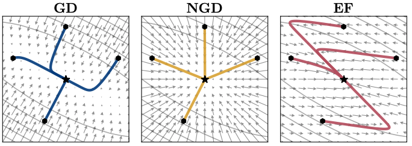

  
<h1 align="center">
  
Topics in Machine Learning: Neural Network Training Dynamics

  
</h1>
  
<b>CSC2541 • Winter • 2022</b>
 
Instructor : Roger Grosse(Associate Professor, University of Toronto)

Lecture notes for courses [Topics in Machine Learning: Neural Network Training Dynamics](https://www.cs.toronto.edu/~rgrosse/courses/csc2541_2022/).

## Lecture Notes

### 📖 Foundational Concepts

- [A Toy Model: Linear Regression](https://github.com/erectbranch/NN-Training-Dynamics/tree/master/lec01/summary01)

  > Linear Regression, Gradient Descent, Invariance to Rigid Transformations(Eigenbasis, Curvature)

  > Convergence Analysis: Coordinatewise Dynamics, Minimum-Cost Subspace, Speed of Convergence(Condition Number), Implicit Regularization

- [Normalization, Double Descent](https://github.com/erectbranch/NN-Training-Dynamics/tree/master/lec01/summary02)

  > Why Normalize the Features: Normalization, Standardization, Whitening

  > Double Descent(Interpolation Threshold, Overparameterization)

### 💡 Understanding Neural Networks

### 🎛 Game Dynamics and Bilevel Optimization

## :mag: Schedule

| Date | Lecture | Topic | Slides | Tutorial |
| --- | --- | --- | --- | --- |
| Jan 13 | Lecture 1 | A Toy Model: Linear Regression | [Slides](https://www.cs.toronto.edu/~rgrosse/courses/csc2541_2022/slides/lec01.pdf), [Readings](https://www.cs.toronto.edu/~rgrosse/courses/csc2541_2022/readings/L01_intro.pdf) | [Slides](https://www.cs.toronto.edu/~rgrosse/courses/csc2541_2022/tutorials/tut01.pdf) |
| Jan 20 | Lecture 2 | Taylor Approximations | [Slides](https://www.cs.toronto.edu/~rgrosse/courses/csc2541_2022/slides/lec02.pdf), [Readings](https://www.cs.toronto.edu/~rgrosse/courses/csc2541_2022/readings/L02_Taylor_approximations.pdf) | [Slides](https://www.cs.toronto.edu/~rgrosse/courses/csc2541_2022/tutorials/tut02.pdf) JAX: [1](https://github.com/google/jax), [2](https://jax.readthedocs.io/en/latest/notebooks/quickstart.html), [3](https://jax.readthedocs.io/en/latest/notebooks/autodiff_cookbook.html), [4](https://github.com/google/jax/blob/master/docs/notebooks/neural_network_with_tfds_data.ipynb) |
| Jan 27 | Lecture 3 | Metrics | [Slides](https://www.cs.toronto.edu/~rgrosse/courses/csc2541_2022/slides/lec03.pdf), [Readings](https://www.cs.toronto.edu/~rgrosse/courses/csc2541_2022/readings/L03_metrics.pdf) | [Colab](https://colab.research.google.com/drive/1AYZXCNreTo0DKXpqDpT0pXorVKkoaI_q?usp=sharing) |
| Feb 3 | Lecture 4 | Second-Order Optimization | [Slides](https://www.cs.toronto.edu/~rgrosse/courses/csc2541_2022/slides/lec04.pdf), [Readings](https://www.cs.toronto.edu/~rgrosse/courses/csc2541_2022/readings/L04_second_order.pdf) | [Slides](https://www.cs.toronto.edu/~rgrosse/courses/csc2541_2022/tutorials/tut04.pdf) |
| Feb 10 | Lecture 5 | Adaptive Gradient Methods, Normalization, and Weight Decay | [Slides](https://www.cs.toronto.edu/~rgrosse/courses/csc2541_2022/slides/lec05.pdf), [Readings](https://www.cs.toronto.edu/~rgrosse/courses/csc2541_2022/readings/L05_normalization.pdf) | [Slides](https://www.cs.toronto.edu/~rgrosse/courses/csc2541_2022/tutorials/tut05.pdf) |
| Feb 17 | Lecture 6 | Infinite Limits and Overparameterization | [Slides](https://www.cs.toronto.edu/~rgrosse/courses/csc2541_2022/slides/lec06.pdf) | - |
| Feb 24 | Lecture 7 | Stochastic Optimization and Scaling | [Slides](https://www.cs.toronto.edu/~rgrosse/courses/csc2541_2022/slides/lec07.pdf) | - |
| Mar 3 | Lecture 8 | Implicit Regularization and Bayesian Inference | [Slides](https://www.cs.toronto.edu/~rgrosse/courses/csc2541_2022/slides/lec08.pdf) | [Slides](https://www.cs.toronto.edu/~rgrosse/courses/csc2541_2022/tutorials/tut08.pdf) |
| Mar 10 | Lecture 9 | Dynamical Systems and Momentum | [Slides](https://www.cs.toronto.edu/~rgrosse/courses/csc2541_2022/slides/lec09.pdf) | [Slides](https://www.cs.toronto.edu/~rgrosse/courses/csc2541_2022/tutorials/tut09.pdf) |
| Mar 17 | Lecture 10 | Differentiable Games | [Slides](https://www.cs.toronto.edu/~rgrosse/courses/csc2541_2022/slides/lec10.pdf) | - |
| Mar 24 | Lecture 11 | Bilevel Optimization I | [Slides](https://www.cs.toronto.edu/~rgrosse/courses/csc2541_2022/slides/lec11.pdf) | - |
| Mar 31 | Lecture 12 | Bilevel Optimization II | [Slides](https://www.cs.toronto.edu/~rgrosse/courses/csc2541_2022/slides/lec12.pdf) | - |