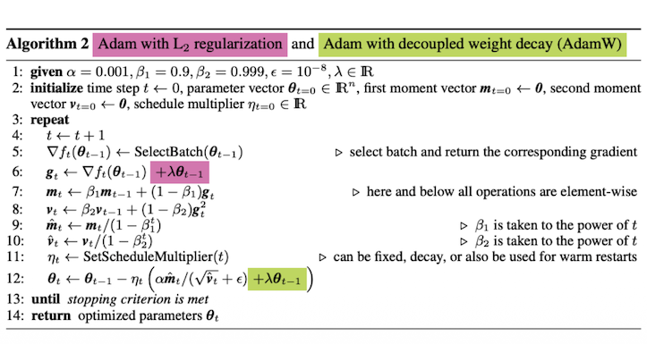
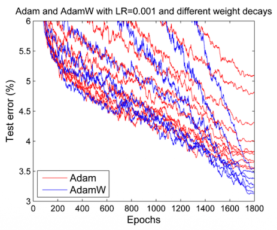
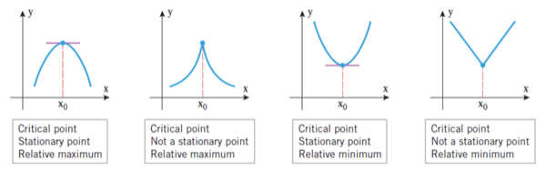
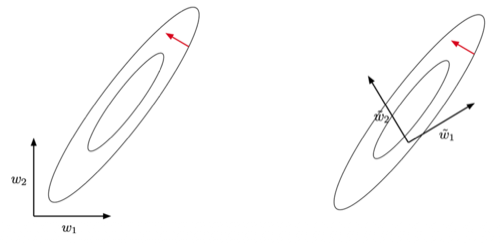
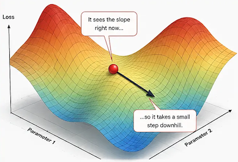
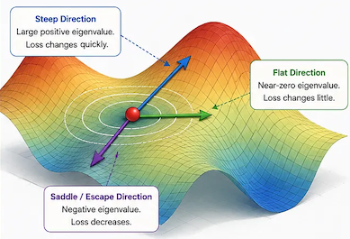
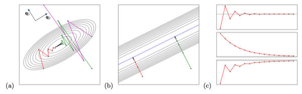
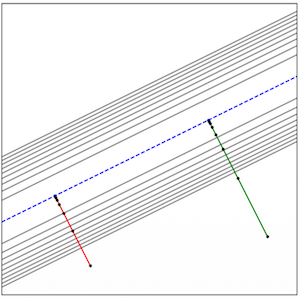
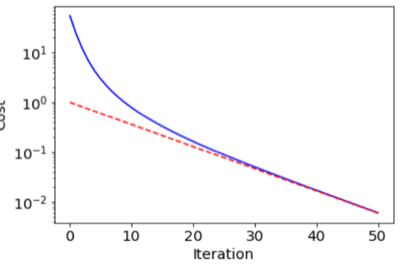

# 1. A Toy Model: Linear Regression

(strongly) convex한 함수를 최소화한다면, 유일한 전역 최적점의 성질만 이해하면 충분하다. 그러나 신경망의 최적화 역학은 nonlinear, nonconvex하므로 분석하기 어렵다. 

따라서, 우선 단순한 모델인 **linear regression**(선형 회귀)에서 'gradient descent는 어떤 해로, 얼마나 빨리 수렴하는가'를 분석한다.

---

## 1.1 Introduction: Why Training Dynamics?

> [Understanding Deep Learning Requires Rethinking Generalization 논문 (2016)](https://arxiv.org/abs/1611.03530)

> [Decoupled Weight Decay Regularization 논문 (2017)](https://arxiv.org/abs/1711.05101)

과거 머신러닝 연구자의 여러 믿음은, 인공지능 도메인의 부상과 함께 뒤집혔다.

| 과거 믿음 | 실제 관찰 |
| --- |--- |
| nonconvex 함수는 최적화하기 어렵다 | 수백만 파라미터를 갖는 ResNet도 몇 줄의 범용 optimizer로 잘 학습된다 |
| 파라미터가 데이터보다 많으면 과적합한다  (그러므로 capacity를 제한해야 한다) | capacity를 늘리면 우연한 패턴(random labels, random pixels)까지 암기하지만, 그럼에도 일반화가 잘 된다. |
| 정규화(목적함수 포함)와 optimizer는 별개로 동작한다. | optimizer에 따라서도 정규화 효과가 달라진다. |

> **Note**: $\ell_2$ penalty Adam vs. AdamW(w. decoupled WD)
>
> - Adam: $\sqrt{\hat{v}}$ 로 기울기를 나누므로, gradient 제곱의 이동 평균 $\hat{v}$ 가 클수록 $\ell_2$ 패널티는 약화된다. (반면, AdamW는 명시적 분리)
>
> | Algorithm | Test Error |
> | :---: | :---: |
> |  |  |

여기서 왜 **training dynamics**(학습 동역학)이 중요한지 알 수 있다.

- overparameterized: 전역 최적점조차 무한히 많다.

- 신경망의 nonconvex한 성질: 어느 local optimum에 도달할지는 동역학(경로)에 달려 있다. (=optimizer가 다르면, 다른 최적해로 수렴)

---

## 1.2 Linear Regression as a Convex Quadratic

선형 회귀는 특징 표현 $\phi(\mathbf{x})$ 에 선형인 모델이다.

$$y = f(\mathbf{x}, \mathbf{w}) = \mathbf{w}^\top \phi(\mathbf{x}) + b$$

비용 함수는 **convex quadratic**(볼록 이차 함수)을 따르는 Mean Square Error(MSE)로 정의할 것이다.

- $\{(\mathbf{x}^{(i)}, t^{(i)})\}_{i=1}^{N}$ : 유한한 학습 데이터셋

$$\mathcal{J}(\mathbf{w}) = \frac{1}{N} \sum_{i=1}^{N} \frac{1}{2} \left( f(\mathbf{x}^{(i)}, \mathbf{w}) - t^{(i)} \right)^2$$

> **Note**: homogeneous coordinate 표현
>
> bias $b$ 를 $\breve{\phi}(\mathbf{x}) = (\phi(\mathbf{x})^\top \ 1)^\top$, $\breve{\mathbf{w}} = (\mathbf{w}^\top \ b)^\top$ 처럼 차원을 하나 추가하는 것으로, $y = \breve{\mathbf{w}}^\top \breve{\phi}(\mathbf{x})$ 로 표현할 수 있다.

- 벡터화: $i$ 번째 행이 $\breve{\phi}(\mathbf{x}^{(i)})^\top$ 인 행렬 $\breve{\Phi}$ 로 표기

$$\breve{\mathbf{w}}^{*} \in \arg\min_{\breve{\mathbf{w}}} \mathcal{J}(\breve{\mathbf{w}}) = \arg\min_{\breve{\mathbf{w}}} \frac{1}{2N} \| \breve{\Phi} \breve{\mathbf{w}} - \mathbf{t} \|^2$$

( $=$ 가 아니라 $\in$ 인 이유: 최소점이 유일하지 않을 수 있기 때문이다. 이어서 판별 방법을 설명할 것이다.)

- 전개하여 다음 표준형을 얻는다. (이하 표기 간결화를 위해 $\breve{\mathbf{w}}$ 대신 $\mathbf{w}$ 로 쓴다.)

$$\mathcal{J}(\mathbf{w}) = \frac{1}{2}\mathbf{w}^\top \mathbf{A}\mathbf{w} + \mathbf{b}^\top \mathbf{w} + c, \qquad \mathbf{A} = \frac{1}{N}\breve{\Phi}^\top \breve{\Phi}, \quad \mathbf{b} = -\frac{1}{N}\breve{\Phi}^\top \mathbf{t}$$

> **Note**: $\mathbf{A}$ 에 대해 염두할 두 가지 성질
>
> 1. **symmetric**: $\mathbf{A} = \frac{1}{N}\breve{\Phi}^\top \breve{\Phi}$ 형태이므로 $\mathbf{A}^\top = \mathbf{A}$.
> 2. **positive semidefinite**: 임의의 방향 $\mathbf{v}$ 에 대해 $\mathbf{v}^\top \mathbf{A} \mathbf{v} = \frac{1}{N}\|\breve{\Phi}\mathbf{v}\|^2 \geq 0$. 비용 함수 그래프를 어느 방향으로 잘라 봐도 단면이 아래로 볼록하거나 평평하다. (즉, $\mathcal{J}$ 는 볼록(convex)하다.)
>
> 여기서 <U>단면이 완전히 평평한 방향</U>($\mathbf{v}^\top \mathbf{A}\mathbf{v} = 0$)<U>이 존재할 수 있다</U>는 말 = "최소해가 유일하지 않을 수 있다"를 의미한다.

> **Note**: 표준형이 toy 이상의 의미를 갖는 이유
>
> - 임의의 매끄러운 비용 함수의 최적점 근처에서, 2차 테일러 근사를 적용하면 이러한 형태를 갖는다. (Lecture 2)
>
> - 특정 조건에서는 신경망 자체가 선형 회귀처럼 동작한다: Neural Tangent Kernel(NTK) (Lecture 6)

---

## 1.3 Fixed Points: Where Can Gradient Descent Stop?

먼저 수렴의 후보지 중 하나인 **fixed point**(고정점)을 살펴보자. Gradient descent(경사 하강법)의 업데이트 규칙은 다음과 같다.

$$\mathbf{w}^{(k+1)} \leftarrow \mathbf{w}^{(k)} - \alpha \nabla_{\mathbf{w}} \mathcal{J}(\mathbf{w}^{(k)})$$

고정점이란 업데이트를 적용해도 그대로인 점이다. (즉, 위 수식에서 $\mathbf{w}^{(k+1)} = \mathbf{w}^{(k)}$ 을 만족하는 점)

$$\mathbf{w} = \mathbf{w} - \alpha \nabla \mathcal{J}(\mathbf{w}) \quad \Longleftrightarrow \quad \nabla \mathcal{J}(\mathbf{w}) = \mathbf{0}$$

즉, 경사 하강법에서 고정점은 **stationary point**(안정점, 기울기가 0인 점)와 정확히 일치한다.

> **Note** (critical point vs. stationary point): critical point(임계점)는 도함수가 0이거나 존재하지 않는 점까지 포함하는 더 넓은 개념이다.
>
> 

일반적으로 고정점은 **stable**(e.g., local optima)할 수도, **unstable**(e.g., saddle point)할 수도 있다. 하지만 선형 회귀는 convex하므로, 모든 고정점이 stable한 전역 최소점이다.

- 표준형 수식

$$\nabla \mathcal{J}(\mathbf{w}) = \mathbf{A}\mathbf{w} + \mathbf{b} = \mathbf{0} \quad \Longleftrightarrow \quad \mathbf{A}\mathbf{w} = -\mathbf{b}$$

---

## 1.4 Invariance to Rigid Transformations

> **Note**: 알고리즘의 **invariance**(불변성)은, 문제를 가장 분석하기 쉬운 좌표계로 옮겨 놓고 분석해도 결론이 보존하게 해준다.

이제 (1) 해가 존재하는가? (2) 해가 유일한가?를 알아야 한다. (<U>해가 유일하지 않다면, 어느 해에 도달하는지는 초기화와 동역학이 결정한다</U>). 분석을 위해선 보다 쉬운 좌표계를 사용할 필요가 있다.

- 경사 하강법은 **rigid transformation**(강체 변환 = 회전, 반사, 평행이동)에 불변이다.

  

강체 변환은 orthogonal matrix $\mathbf{Q}$ 를 사용해 $\bar{\mathbf{w}} = \mathcal{T}(\mathbf{w}) = \mathbf{Q}^\top(\mathbf{w} - \mathbf{t})$ 로 표기할 수 있다.

> **Note**: orthogonal matrix(직교 행렬): $\mathbf{Q}^\top \mathbf{Q} = \mathbf{Q}\mathbf{Q}^\top = \mathbf{I}$, 즉, 전치가 곧 역행렬이다. (기하학적으로는 길이와 각도를 보존하는 변환(회전·반사)에 해당)

증명은 귀납법으로 간단하다.

(1)  $\bar{\mathbf{w}}^{(0)} = \mathcal{T}(\mathbf{w}^{(0)})$ 에서 출발

(2)  $\bar{\mathbf{w}}^{(k)} = \mathcal{T}(\mathbf{w}^{(k)})$ : 변환된 비용 함수 $\bar{\mathcal{J}}(\bar{\mathbf{w}}) = \mathcal{J}(\mathbf{Q}\bar{\mathbf{w}} + \mathbf{t})$ 에 대한 한 스텝이 정확히 $\mathcal{T}(\mathbf{w}^{(k+1)})$ 와 일치한다.

즉, <U>두 좌표계에서의 궤적(trajectory)이 완전히 동일하다</U>.

> **Note**: Adam, RMSProp처럼 **좌표(축)별로 다른 학습률**을 적용하는 알고리즘은 회전하면 동역학이 달라진다. (Lecture 5)

---

### 1.4.1 Rotating to the Eigenbasis: Spectral Decomposition

> [Nikhil Kishore: When the Loss Landscape Has a Map](https://medium.com/@kishore.nikhil2090/when-the-loss-landscape-has-a-map-lessons-from-hessian-guided-optimization-72a8b36707cc)

불변성을 활용해 $\mathbf{A}$ 가 가장 단순해지는 좌표계, 즉 **eigenbasis**(고유기저)로 회전해 보자.

> **Note**: spectral decomposition(스펙트럴 분해)
>
> 대칭 행렬 $\mathbf{A}$ 는 항상 서로 수직인 방향 $\mathbf{q}_1, \ldots, \mathbf{q}_D$ (고유벡터)와 실수 $\tilde{a} _1, \ldots, \tilde{a} _D$ (고유값)로 분해된다:
>
> $$\mathbf{A} = \mathbf{Q}\mathbf{D}\mathbf{Q}^\top$$
>
> $\mathbf{Q}$ 는 고유벡터를 열로 갖는 직교 행렬, $\mathbf{D} = \text{diag}(\tilde{a} _1, \ldots, \tilde{a} _D)$ 는 고유값의 대각 행렬이다. 핵심은 <U>각 고유벡터 방향에서 $\mathbf{A}$ 는 그저 숫자 $\tilde{a} _j$ 를 곱하는 것처럼 작동</U>하는 점이다.

손실 표면을 수평으로 자른 등고선(타원)에서 고유벡터는 이 타원의 주축이며, 고유값 $\tilde{a} _j$ 는 각 축 방향으로 손실이 휘는 정도인 **curvature**(곡률)을 의미한다.

- 곡률이 모두 양수면 손실 표면은 그릇(bowl) 모양이며, 곡률 0인 방향은 한쪽으로 무한히 이어지는 골짜기(바닥 = minimum-cost subspace)에 해당한다.

- 등고선의 타원이 길수록, 곡률은 작은 평평한 방향이다.

| Gradient Descent| Hessian
|:---:|:---:
|  | 

이제 $\tilde{\mathbf{w}} = \mathbf{Q}^\top \mathbf{w}$ 로, 고유벡터 축으로 좌표를 회전하면 수식은 다음과 같다. ( $\mathbf{q}_1, \ldots, \mathbf{q}_D$ :고유벡터 )

$$\tilde{\mathcal{J}}(\tilde{\mathbf{w}}) = \frac{1}{2}\tilde{\mathbf{w}}^\top \tilde{\mathbf{A}}\tilde{\mathbf{w}} + \tilde{\mathbf{b}}^\top \tilde{\mathbf{w}} + c, \qquad \tilde{\mathbf{A}} = \mathbf{Q}^\top \mathbf{A}\mathbf{Q} = \mathbf{D}, \quad \tilde{\mathbf{b}} = \mathbf{Q}^\top \mathbf{b}$$

$\tilde{\mathbf{A}}$ 가 대각 행렬이 되었다. 1.4의 불변성 덕분에, <U>이 좌표계에서 분석한 동역학은 원래 좌표계의 동역학과 완전히 같다</U>.

> 회전한 좌표계에서 얻은 결론에서, $\mathbf{Q}$ 를 곱하면 원래 좌표계로 그대로 가져올 수 있다.

---

## 1.5 Coordinatewise Dynamics

$\tilde{\mathbf{A}}$ 가 대각 행렬이면 $D$ 차원 문제를 **서로 간섭하지 않는 $D$ 개의 1차원 문제**로 다룰 수 있다. 각 좌표가 독립적으로 진화하기 때문이다.

$$\tilde{w} _j^{(k+1)} \leftarrow \tilde{w} _j^{(k)} - \alpha(\tilde{a} _j \tilde{w} _j^{(k)} + \tilde{b} _j)$$

곡률 $\tilde{a} _j$ 의 값에 따라 세 가지 경우로 나뉜다.

**Case 1: $\tilde{a} _j > 0$ (휘어진 방향).** 유일한 고정점 $\tilde{w} _{\ast j} = -\tilde{b} _j / \tilde{a} _j$ 가 존재하며, 점화식을 풀면 다음과 같다.

$$\tilde{w} _j^{(k)} = \tilde{w} _{\ast j} + (1 - \alpha\tilde{a} _j)^k (\tilde{w} _j^{(0)} - \tilde{w} _{\ast j})$$

즉, 궤적은 $(1-\alpha \tilde a_j)$ 의 크기, 즉 $\alpha\tilde{a} _j$ 가 결정한다:

| Case | 조건 | 동역학 |
|:---:|:---|:---|
| 1(a) | $0 < \alpha\tilde{a} _j < 2$ | 고정점으로 **지수적 수렴** ($<1$ 이면 단조 수렴, $1<\alpha\tilde a_j<2$ 이면 진동하며 수렴) |
| 1(b) | $\alpha\tilde{a} _j = 2$ | **진동**만 하고 수렴하지 않음 |
| 1(c) | $\alpha\tilde{a} _j > 2$ | **지수적 발산** |

**Case 2: $\tilde{a} _j = 0$, $\tilde{b} _j \neq 0$ (평평한데 기울기가 있는 방향).** $\tilde{w} _j^{(k)} = \tilde{w} _j^{(0)} - \alpha k \tilde{b} _j$ 로 **선형 발산**한다.

**Case 3: $\tilde{a} _j = 0$, $\tilde{b} _j = 0$ (완전히 평평한 방향).** 기울기가 전혀 없으므로 $\tilde{w} _j^{(k)} = \tilde{w} _j^{(0)}$, **초기값에서 전혀 움직이지 않는다**.

> **(a)** $\mathbf{A}$ 가 full rank이고 $\alpha$ 가 충분히 작으면 유일한 전역 최소점으로 수렴(빨강·초록), 학습률이 너무 크면 발산(자주색)
>
> **(b)** $\mathbf{A}$ 가 low rank이면, 최소점이 이루는 직선(파란 점선) 위의 가장 가까운 점으로 수렴   (2차원 기준으로 고유값 하나가 0이라면, 타원은 한 방향으로만 늘어나며 골짜기를 형성한다. 이는 서로 수직인 고유벡터 중 (고유값이 0이 아닌) 휘어진 방향으로 수선의 발을 내린 형태다. = minimum-cost subspace)
>
> **(c)** (a)의 궤적을 고유벡터 $\mathbf{q}_1$ (위), $\mathbf{q}_2$ (중간) 방향으로 사영하면 지수 함수 형태, 임의 방향(아래)으로 사영하면 지수 함수들의 중첩이다.
>
> 

종합하면 **수렴 조건**은 두 가지(Case 1(a) 또는 Case 3)다.

- **A1**: $\mathcal{J}$ 가 **bounded below**(하한을 가짐) — Case 2를 배제한다. ($\tilde a_j = 0,\ \tilde b_j \neq 0$ 인 방향이 있으면, 그 방향으로 비용이 한없이 내려가는 일차 함수가 되어 하한이 없다.) (현재 관심사인 선형 회귀는 제곱 합 형태이므로 $\mathcal{J} \geq 0$ 를 만족.)

- **A2**: $\alpha < 2\tilde{a} _{\max}^{-1}$ (학습률 안정 조건, $\tilde{a} _{\max}$ 는 최대 고유값) — Case 1(b), 1(c)를 배제한다.

---

## 1.6 Where Does It Converge? — The Minimum-Cost Subspace

수렴 조건을 만족한다면 어디로 수렴할까? 최소점이 유일하지 않다면 답은 "점"이 아니라 "집합" 속의 한 점이며, <U>어느 점인지는 초기화가 결정한다</U>.

여기서 비용을 최소화하는 점들의 집합을 **minimum-cost subspace**(최소 비용 부분공간)라 부른다.

> **Note**: null space
>
> $\text{null}(\mathbf{A}) = \{\mathbf{v} \mid \mathbf{A}\mathbf{v} = \mathbf{0}\}$ 는 $\mathbf{A}$ 가 소멸시키는 방향의 집합(영공간)으로, 항상 원점을 지난다. 현재 $\mathbf{A}$ 에서는 고유값이 0인 고유벡터의 공간, 즉 <U>곡률이 0인 평평한 방향 집합</U>이다. 어떠한 최소점 $\mathbf{w}_\ast$ 에서 평평한 방향으로 아무리 이동하든 여전히 최소점이다.

> **Note**: minimum-cost subspace
>
> 최소 비용 부분공간은 비용을 최소화하는 위치의 집합으로, 어떤 최소점 $\mathbf{w}_{\ast}$ 에서 평평한 방향으로 아무리 이동하든 여전히 최소점이다.
>
> $$\arg\min_{\mathbf{w}} \mathcal{J}(\mathbf{w}) = \{\mathbf{w}_{\ast} + \Delta\mathbf{w} \mid \Delta\mathbf{w} \in \text{null}(\mathbf{A})\}$$

다음은 앞서 고유값/고유벡터로 나눈 분석을, 다시 벡터로 합친 수식이다.

$$\mathbf{w}^{(k)} = \mathbf{w}^{(\infty)} + (\mathbf{I} - \alpha\mathbf{A})^k (\mathbf{w}^{(0)} - \mathbf{w}^{(\infty)})$$

여기서 도달점 $\mathbf{w}^{(\infty)}$ 이 핵심이다. Case 1(a) 방향(곡률 > 0)에서는 고정점까지 이동하지만, Case 3 방향에서는 초기값에 그대로 머무른다. 

따라서 $\mathbf{w}^{(\infty)}$ 는 최소 비용 부분공간의 점들 중 초기화 $\mathbf{w}^{(0)}$ 에서 가장 가까운 점, 즉 부분공간에 **projection**(사영)한 점이다.

$$\mathbf{w}^{(\infty)} = \arg\min_{\mathbf{w}} \|\mathbf{w} - \mathbf{w}^{(0)}\|^2 \quad \text{s.t.} \quad \mathbf{w} \in \arg\min_{\mathbf{w}'} \mathcal{J}(\mathbf{w}')$$

> 파란 점선이 최소 비용 부분공간, 빨강·초록 궤적은 각자의 출발점에서 부분공간으로 사영한 것이다.

$\mathbf{w}^{(\infty)}$ 의 닫힌 형태 식도 구할 수 있다. (1.5 수식 참고)

> **Note**: pseudoinverse(유사 역행렬) — $\mathbf{A}$ 는 평평한 방향(고유값 0)이 있으면 역행렬이 없다. Pseudoinverse는 <U>뒤집을 수 있는 방향(고유값 > 0)만 역수를 취하고, 평평한 방향은 그냥 0으로 두는 "부분 역행렬"</U>이다.
>
> $$\mathbf{A}^{\dagger} = \mathbf{Q}\mathbf{D}^{\dagger}\mathbf{Q}^\top$$
>
> $\mathbf{D}^\dagger$ 는 0이 아닌 대각 원소만 역수를 취한 대각 행렬이다. $\mathbf{A}$ 가 가역이면 $\mathbf{A}^\dagger = \mathbf{A}^{-1}$ 로 일치한다.  (일반 행렬 $\mathbf{B}$ 에 대해서는 SVD로 같은 방식으로 정의하며, $(\mathbf{B}^\top\mathbf{B})^{-1}$ 이 존재하면 $\mathbf{B}^\dagger = (\mathbf{B}^\top\mathbf{B})^{-1}\mathbf{B}^\top$ 로도 쓸 수 있다.)

$$\mathbf{w}^{(\infty)} = -\mathbf{A}^{\dagger}\mathbf{b} = \breve{\Phi}^{\dagger}\mathbf{t}$$

원점에서 가장 가까운 최소점이므로, 이는 <U>최소점들 중 노름이 가장 작은 해, **minimum-norm solution**</U>이다.

---

## 1.7 How Fast Does It Converge?

'얼마나 빨리 수렴하는가?'에서 관건은, 가장 느린 방향이 전체 속도를 결정한다는 점이다. 여기서 느린 정도를 수치화한 지표가 바로 **condition number**(조건수)다.

먼저, 고유기저에서 비용 함수는 좌표별 기여의 합으로 분해할 수 있다. ( $c$ 는 상수 )

$$\tilde{\mathcal{J}}(\tilde{\mathbf{w}}) = \sum_{j:\tilde{a} _j > 0} \frac{\tilde{a} _j}{2}(\tilde{w} _j - \tilde{w} _{\ast j})^2 + c$$

(1.5절) $\tilde{w} _j^{(k)} - \tilde{w} _{\ast j} = (1-\alpha\tilde{a} _j)^k (\tilde{w} _j^{(0)} - \tilde{w} _{\ast j})$ 를 대입하면, <U>각 좌표의 비용 함수에 대한 기여는 매 반복마다 $(1 - \alpha\tilde{a} _j)^{2k}$ 배율로 지수적으로 감소</U>한다.

- $\alpha\tilde{a} _j \ll 1$ 일 때,

$$(1 - \alpha\tilde{a} _j)^{2k} \approx \exp(-2\alpha\tilde{a} _j k)$$

즉, $2\alpha\tilde{a} _j$ 가 특정 방향에서의 수렴 속도다.

> 곡률(고유값)이 큰 방향은 빠르게, 작은 방향은 느리게 수렴한다.

---

### 1.7.1 Condition Number

문제는 학습률을 마음대로 키울 수 없다. 안정성(1.5절 A2)을 위해 $\alpha \leq \tilde{a} _{\max}^{-1}$ 조건을 두면, 가장 느린(0이 아닌 최소 곡률) 방향의 속도는 기껏해야 다음과 같다.

$$\alpha\, \tilde{a} _{\min} \leq \frac{\tilde{a} _{\min}}{\tilde{a} _{\max}} = \kappa^{-1}, \qquad \kappa = \frac{\tilde{a} _{\max}}{\tilde{a} _{\min}}$$

| $\kappa$ | 상태 | 수렴 |
|:---:|:---|:---|
| $\kappa \approx 1$ | **well-conditioned** | 모든 방향이 비슷하게 빠름 |
| $\kappa \gg 1$ | **ill-conditioned** | 가파른 방향이 학습률을 제한해, 평평한 방향이 극도로 느림 |

이처럼 느린 방향들이 손실을 지배하게 되고, 목표 정확도 $\epsilon$ 에 도달하는 데 $O(\kappa \log \frac{1}{\epsilon})$ 번의 반복이 필요하다. (그래서 경사 하강법을 $O(\kappa)$ 알고리즘이라고도 부르며, $\kappa$ 는 최적화 문제의 난이도 지표로 쓰인다.)

다음은 곡률 고유값 $\{1, \ldots, 10\}$ 을 갖는 이차 목적 함수의 수렴 곡선이다. (파란색: 총 비용, 빨간 점선: 최소 곡률 방향의 비용)

> <U>초반에는 가파른 방향들이 빠르게 정리되지만, 후반은 가장 느린 방향이 지배한다</U>.

---

## 1.8 Implicit Regularization

> 경사 하강법은 아무런 regularization 항을 추가하지 않았지만, $\ell_2$ 정규화가 있는 것 같은 해를 획득함을 알 수 있다. (정확히는, 강도가 무한소( $\lambda \to 0$ )인 정규화와 동일)

앞서 1.6절에서 "어디로 수렴하는가 = minimum-norm 해"를 확인했다. 사실 이는 **정규화를 명시하지 않았지만 정규화된 해**를 얻은 효과다.

다음은 $\ell_2$ 정규화를 명시적으로 추가한 **ridge regression**이다. ( $\lambda$ : 정규화 강도 )

$$\mathcal{J}_\lambda(\breve{\mathbf{w}}) = \frac{1}{2N}\|\breve{\Phi}\breve{\mathbf{w}} - \mathbf{t}\|^2 + \frac{\lambda}{2}\|\breve{\mathbf{w}}\|^2$$

- $\lambda > 0$ 이면 최적해가 유일하다. 

  $\frac{\lambda}{2}\|\breve{\mathbf{w}}\|^2$ 항으로 인해, 곡률 $\lambda$ 를 갖는 포물선이 형성되기 때문 (이전에 해가 무수히 많은 평평한 바닥이었어도 휘어지게 된다.)

$$\breve{\mathbf{w}}_\lambda = (\breve{\Phi}^\top \breve{\Phi} + \lambda\mathbf{I})^{-1}\breve{\Phi}^\top \mathbf{t}$$

- $\lambda \to 0$ 극한을 취하면 다음과 같다.

$$\lim_{\lambda \to 0} \breve{\mathbf{w}}_\lambda = \breve{\Phi}^{\dagger}\mathbf{t} = \breve{\mathbf{w}}^{(\infty)}$$

(명시적인 정규화가 없지만) $\mathbf{w}^{(0)}=\mathbf{0}$ 에서 경사 하강법을 수행한 결과는, 현재 ridge regularization의 극한 해와 정확히 일치한다. 이처럼 목적 함수에 없는 정규화 효과를 동역학이 만들어내는 현상을 **implicit regularization**(암묵적 정규화)이라 한다.

> "optimizer가 해를 정한다"의 구체적인 첫 사례다. (Lecture 8: 각 optimizer가 어떠한 암묵적 정규화를 갖는가?)

---
