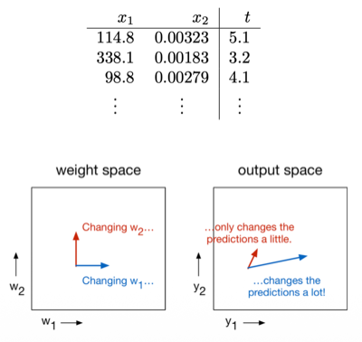
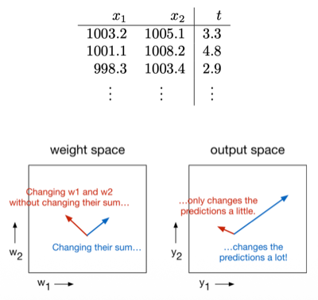
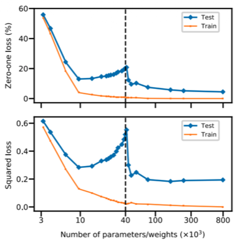
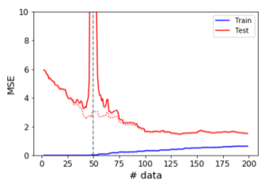
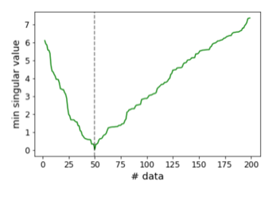

# 1. A Toy Model: Linear Regression

앞서 (1) 수렴 속도는 condition number $\kappa$ 가 결정하고, (2) 경사 하강법은 초기화에서 가장 가까운(원점 초기화 시 minimum-norm) 최소점으로 수렴했다.

> **Note**: feature 공분산의 직관적 이해
>
> (1) 분산: 각 예시에서 편차를 제곱하여 평균한 값
>
> $$\sigma_1^2 = \frac{1}{N}\sum_{i=1}^{N}(\phi_{1,i} - \mu_1)^2$$
>
> (2) 공분산: 서로 다른 예시(feature)의 편차를 곱하여 평균한 값 = 즉, <U>두 feature가 어떻게 함께 변하는가</U>
>
> - 양의 공분산 : feature 1이 평균보다 클 때, feature 2도 평균보다 큰 경향 (e.g., 이미지 내 이웃한 두 픽셀: 같이 밝거나 같이 어두움)
>
> - 음의 공분산 : 하나가 클 때, 다른 하나는 작은 경향
>
> - 공분산 $\approx 0$ : 서로 무관
>
> $$\text{Cov}(\phi_{1}, \phi_{2}) = \frac{1}{N}\sum_{i=1}^{N}(\phi_{1,i} - \mu_1)(\phi_{2,i} - \mu_2)$$

> 공분산 행렬이 대각 행렬이다 = 모든 feature 쌍의 상관관계가 0이다.

---

## 1.9 Why Normalize the Features?

입력을 평균 0, 분산 1로 맞추는 **normalize/standardize** 방법이 어째서 도움이 되는지를, 조건수 $\kappa$ 로 설명할 수 있다.

$$\tilde{\phi} _j(\mathbf{x}) = \frac{\phi_j(\mathbf{x}) - \mu_j}{\sigma_j}, \qquad \mu_j = \frac{1}{N}\sum_{i=1}^{N}\phi_j(\mathbf{x}^{(i)}), \quad \sigma_j^2 = \frac{1}{N}\sum_{i=1}^{N}(\phi_j(\mathbf{x}^{(i)}) - \mu_j)^2$$

> 수렴 속도는 곡률 행렬 $\mathbf{A}$ 의 고유값 비율($\kappa$)에 달려 있었다. ( $\mathbf{A} = \frac{1}{N}\breve{\Phi}^\top \breve{\Phi}$ ) 
>
> - 잘 보면 $\mathbf{A}$ 는 feature 벡터를 outer product한 뒤, 평균한 것과 같다.

이는 데이터(feature 벡터)의 통계가 $\mathbf{A}$ 의 고유값을 어떻게 결정하는지를 보면 된다. 

- 다음은 feature의 empirical mean $\boldsymbol{\mu}$ 와 empirical covariance $\boldsymbol{\Sigma}$ 로 $\mathbf{A}$ 를 재구성한 행렬이다. (homogeneous coordinate의 bias 차원 포함)

$$\mathbf{A} = \begin{pmatrix} \boldsymbol{\Sigma} + \boldsymbol{\mu}\boldsymbol{\mu}^\top & \boldsymbol{\mu} \\ \boldsymbol{\mu}^\top & 1 \end{pmatrix}$$

> **Note** (수식의 등장 배경): $\breve{\phi_j} \breve{\phi_j}^\top = \begin{pmatrix} \phi_i \\ 1 \end{pmatrix} \begin{pmatrix} \phi_i^\top &  1 \end{pmatrix} = \begin{pmatrix} \phi_i \phi_i^\top & \phi_i \\ \phi_i^\top & 1 \end{pmatrix}$ 를 $i$ 에 대해 평균 (좌상단 항은 공분산 수식을 정리하면 $\boldsymbol{\Sigma} + \boldsymbol{\mu}\boldsymbol{\mu}^\top$ 와 동일)

세 가지 경우를 보면 정규화가 어째서 필요한지 알 수 있다.

| No. | Case | $\mathbf{A}$ | $\kappa$ |
|:---:|:---|:---|:---|
| 1 | $\boldsymbol{\mu} = \mathbf{0}$, $\boldsymbol{\Sigma} = \mathbf{I}$ ("white" feature) | $\mathbf{A} = \mathbf{I}$ | $1$ (완벽한 조건화로, 한 스텝에 수렴) |
| 2 | $\boldsymbol{\mu} = \mathbf{0}$, 대각 행렬 $\boldsymbol{\Sigma}$ | 고유값이 feature의 분산인 대각 행렬  고유값 = $\lbrace \sigma_{1}^2, \sigma_{2}^2, \ldots, \sigma_D^2, 1 \rbrace$ | $\sigma_{\max}^2 / \sigma_{\min}^2$ |
| 3 | $\boldsymbol{\mu} \neq \mathbf{0}$ (uncentered) | $\approx \|\boldsymbol{\mu}\|^2 + 1$ 크기의 **outlier 고유값** 등장 | 차원 $D$ 크기에 따라 커짐 |

> **Note** (3번 등장 배경): $\mathbf{v}=(\mu, 1)$ 벡터가 있다고 하고 $\mathbf{A}\mathbf{v}$ 를 계산하면, 대략 $\|\boldsymbol{\mu}\|^2 + 1$ 크기의 outlier 고유값을 획득할 수 있다. (고유벡터: 방향이 변하지 않으므로 어떤 벡터든 대입 가능) ( $\Sigma$ 항은 유한하므로 무시 가능 )

특히 3번이 심각하다. $\|\boldsymbol{\mu}\|^2$ 은 차원 $D$ 에 비례해 커지는 반면 나머지 고유값이 유한하므로, <U>중심화되지 않은(uncentered) 고차원 데이터는 극도로 ill-conditioned</U>하게 된다.

기하학적 직관은 다음과 같다.

| 2번: 스케일이 크게 다른 경우 | 3번: 평균이 0에서 먼 경우 |
|:---:|:---:|
|  |  |
| 큰 스케일의 feature 방향으로만 예측이 민감  → **rescaling** 필요 | 모든 feature 값이 비슷  → 가중치를 합산( $y=\sum_i w_i \phi_i + b$ )한 방향으로만 민감  → **centering** 필요 |

정리하자면 **centering**($\boldsymbol{\mu} = \mathbf{0}$)은 outlier 고유값을 제거하고, **normalization**($\sigma_j = 1$)은 feature 간 분산 차이를 보정한다. (다만, feature 사이의 상관관계까지는 보정하지 못한다.)

---

### 1.9.1 Pitfalls of Full Whitening

상관관계까지 제거하고 $\boldsymbol{\Sigma}$ 를 완전히 $\mathbf{I}$ 로 만드는 **whitening** $\mathbf{S}^{-1}$ 도 가능하다. $\mathbf{S}\mathbf{S}^\top = \boldsymbol{\Sigma}$ 를 만족하는 $\mathbf{S}$ 로 두면, $\tilde\phi(\mathbf{x}) = \mathbf{S}^{-1}(\phi(\mathbf{x}) - \boldsymbol{\mu})$ 이다. 

그러면 $\kappa = 1$ 이므로 최적화 관점에서는 항상 이득이다. 그런데 왜 표준 관행이 아닐까? 이유는 <U>학습 손실의 수렴만이 아니라 **generalization**(일반화)까지 신경써야 하기 때문</U>이다.

- 분산이 큰 방향 = **principal component**(주성분) = 신호(signal)가 많이 담겨 있다고 믿는 방향

- 그 방향에서 먼저·빠르게 수렴하는 것은 유용한 **inductive bias**(귀납적 편향)인데, whitening은 모든 방향을 균등하게 만들어 이 편향을 지워 버린다. (noise 방향까지 빠르게 학습 → 과적합 위험)

- 반면 평균과 분산 자체는 단위(unit) 선택에 따라 달라지는 임의적 정보라 지워도 잃을 것이 적다. 그래서 normalization까지는 일반적으로 안전하다.

> 수렴을 가속하는 정규화 트릭을 발견하면 반드시 점검해야 한다: "이 가속이 일반화에 도움이 되는 방식인가?"

---

### 1.9.2 Lessons for Neural Nets

> [Efficient BackProp 논문(1998)](https://cseweb.ucsd.edu/classes/wi08/cse253/Handouts/lecun-98b.pdf)

> [Batch Normalization: Accelerating Deep Network Training by Reducing Internal Covariate Shift 논문(2015)](https://arxiv.org/abs/1502.03167)

(선형 회귀에서 더 나아가) 신경망에서는 각 층의 hidden activation이 다음 층의 '입력'이므로, 층이 깊어질수록 문제도 반복된다.

uncentered activation도 입력의 uncentered feature와 마찬가지로, Hessian에 큰 outlier 고유값을 만들며 ill-conditioning을 유발한다.

| 활성화 함수 | 출력 범위 | Centering 관점 |
|:---:|:---:|:---|
| Logistic: $\sigma(z) = \frac{1}{1+e^{-z}}$ | $(0, 1)$ | 항상 양수 → uncentered → 조건화 나쁨 |
| Tanh | $(-1, 1)$ | 0 중심 → 조건화 유리 |

> 때문에 ReLU 이전 시대에는 logistic 대신 tanh가 표준이었다.

대표적으로 학습이 진행되며 activation의 분포가 점차 변해 uncentered 상태가 되는 **internal covariate shift**에 대응해, activation을 직접 centering/rescaling하는 **Batch Normalization**이 고안되었다.

---

## 1.10 Double Descent

> [Reconciling modern machine learning practice and the bias-variance trade-off 논문(2018)](https://arxiv.org/abs/1812.11118)

> [Deep Double Descent: Where Bigger Models and More Data Hurt 논문(2019)](https://arxiv.org/abs/1912.02292)

고전적인 배경지식은 모델 복잡도(파라미터 수)를 늘리면 test error가 U자 곡선을 그리는 것이다. 그러나 실제로 관찰되는 현상은 **double descent**로, test error가 내려갔다가 어느 임계점에서 치솟은 뒤, <U>다시 내려간다</U>.

- 점선 = **interpolation threshold**(보간 임계점): 학습 데이터를 가까스로 모두 암기할 수 있는 경계 지점 (모두 암기하기 위해 해가 강제된다.)

그렇다면 선형 회귀에서도 double descent를 설명할 수 있을까? 파라미터 수 변화 대신, 차원 $D = 50$ 으로 고정하고 학습 데이터 수 $N$ 을 변화시킬 수 있다. 이때도 double descent 현상이 관찰된다.  (test error: $N \approx D$ 에서 치솟는다.)

| Training / Test Error | $\breve{\Phi}$ 의 최소 nonzero 특이값 |
|:---:|:---:|
|  |  |

다음은 실험을 세 구간으로 나눠서 일반화 능력을 분석한 도표이다.

| 영역 | 조건 | 설명 |
|:---:|:---|:---|
| $N \gg D$ | 데이터 충분 | 최적 파라미터가 데이터로 확정됨 → 잘 일반화 |
| $N \approx D$ | 보간 임계점 | 학습 데이터를 "가까스로" 맞출 수 있음 → 억지로 맞추느라 **매우 큰** $\|\mathbf{w}\|$ 필요 → 일반화 성능 저하 |
| $N \ll D$ | 과매개변수화 | 데이터를 맞추는 해가 많음 → implicit regularization이 **작은** $\|\mathbf{w}\|$ 해를 선택 → 다시 성능 향상 |

> **Note**: $N \approx D$ 에서 $\|\mathbf{w}\|$ 가 커지는 이유
>
> 앞서 수렴 해 $\breve{\mathbf{w}}^{(\infty)} = \breve{\Phi}^{\dagger}\mathbf{t}$ 의 pseudoinverse는 특이값의 역수를 취한다고 하였다. 여기서 $\breve{\Phi}$ 의 <U>가장 작은 nonzero 특이값이 작을수록 해가 커지며</U>, 그 최소 특이값은 정확히 $N = D$ 에서 0에 가장 가까워진다. 
>
> (예를 들어, $k$ 번째 feature 벡터는 기존의 $k -1$ 개의 벡터 조합으로 표현 가능한 정보 이외의, 잔여 성분만 새로운 차원에서 표현하면 된다.)

> (아예 $N < D$ 인 경우, 어떠한 feature 벡터도 표현하지 않는 차원이 $D-N$ 개 있지만, 이들은 고유값이 0이므로 pseudoinverse에서 버려진다.)

참고로, 명시적 $\ell_2$ 정규화를 추가하면 double descent 현상은 완전히 사라진다. 그래서 double descent는 "정규화가 불완전할 때 나타나는 병리 현상"으로 보는 관점이 타당하지만, 여전히 여러 SOTA 학습 방법론에서 종종 관찰된다. (아직 선형 회귀의 $\ell_2$ 만큼 원칙적이고 강건한 정규화 방법이 없음을 시사한다.)

---

## 1.11 Discussion: Why Spend So Much Time on Linear Regression?

선형 회귀에 대한 분석은 원칙적으로 신경망의 성질을 아무것도 보장하지 않는다. 그럼에도 신경망 분석에서 여러 직관을 얻을 수 있다.

1. **Model system**: 모델 분석에 대한 직관을 제공한다.

2. **Taylor 근사의 보편성** — 임의의 비용 함수도 최적점 근처에서 2차 테일러 근사를 적용하면 convex quadratic이다. 따라서, 이번 분석이 신경망의 국소 수렴 거동에서 그대로 적용된다. (Lecture 2)

3. **Neural Tangent Kernel** — 놀랍게도 특정 조건에서는 신경망 자체가 랜덤 feature에서의 선형 회귀로 잘 근사할 수 있다. (Lecture 6)

---