# 2. Taylor Approximations

**Taylor approximation**(테일러 근사)를 활용해 관심 지점 근처에서 비용 함수를 1차(선형) 또는 2차(quadratic)로 근사하면, Lecture 1의 분석을 신경망에서도 국소적으로 적용할 수 있다. 

---

## 2.1 First-Order Taylor Approximation: The Jacobian

> [Nick Alger: What do I do with these equations to create a Jacobian matrix?](https://math.stackexchange.com/questions/951917/what-do-i-do-with-these-equations-to-create-a-jacobian-matrix)

non-linear 함수를 분석하기 위해선 '**입력을 살짝 바꾸면 출력이 얼마나 바뀌는가**'를 먼저 알아야 한다. 그리고, 그 답은 **Jacobian matrix**(야코비 행렬)으로 알 수 있다.

$\mathbf{x}_0$ 에서 미분 가능한 함수 $f: \mathbb{R}^m \to \mathbb{R}^n$, $\mathbf{y} = f(\mathbf{x})$ 는 **first-order Taylor approximation**(1차 테일러 근사)로 **linearization**(선형화)할 수 있다.

$$f(\mathbf{x}) = f(\mathbf{x}_0) + \mathbf{J}_{\mathbf{yx}}(\mathbf{x}_0)(\mathbf{x} - \mathbf{x}_0) + o(\|\mathbf{x} - \mathbf{x}_0\|)$$

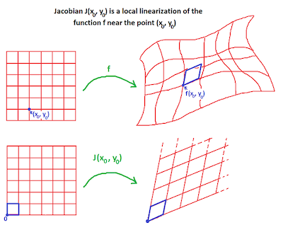

- 변화량 표기는 다음과 같다. (변화량 = 선형 근사 예측 + 예측 오차)

$$\Delta\mathbf{y} = \mathbf{J}_{\mathbf{yx}}\Delta\mathbf{x} + o(\|\Delta\mathbf{x}\|)$$

> **Note**: $\Delta\mathbf{x}$ 를 0으로 보낼수록(**작은 학습률**) 오차는 제곱으로 줄어드므로, $o(\|\Delta\mathbf{x}\|)$ 은 선형 항과 달리 무시할 수 있게 된다. 

> 신경망에서 입력 데이터는 고정이므로, 가중치 $\mathbf{w}$ 가 변할 때 출력의 변화로 활용하게 된다.

이때 Jacobian은 모든 1차 편미분을 모은 $n \times m$ 행렬이다. (신경망에서는 입력 데이터는 고정이며, 가중치가 변화한다. 즉, 분모항을 가중치로 염두해야 한다.)

$$[\mathbf{J}_{\mathbf{yx}}(\mathbf{x}_0)]_{ij} = \frac{\partial y_i}{\partial x_j}\bigg|_{\mathbf{x}_0}$$

> **Notes** (입력 $m$ 개, 출력 $n$ 개) 입력을 살짝 바꾸면 출력이 얼마나 바뀌는지를 나타내는, 모든 편미분( $\partial y_i / \partial x_j$ ) 쌍을 행렬로 모은 셈이다.

다음은 신경망을 구성하는 두 가지 대표 연산의 Jacobian이다.

| 연산 | Jacobian |
|:---|:---|
| Matrix-vector product: $\mathbf{z} = \mathbf{W}\mathbf{x}$ | $\mathbf{J}_{\mathbf{zx}} = \mathbf{W}$ |
| Elementwise 연산: $\mathbf{y} = \exp(\mathbf{z})$ | $\mathbf{J}_{\mathbf{yz}} = \mathrm{diag}(\exp(z_1), \ldots, \exp(z_D))$ |

> **Notes**: 비용 함수의 출력이 스칼라인 경우 ( $\mathcal{J}: \mathbb{R}^m \to \mathbb{R}$ )
>
> Jacobian은 $1 \times m$ 행 벡터가 되며, 실질 gradient를 전치한 것이다: $\mathbf{J}_{\mathbf{yx}} = (\nabla \mathcal{J}(\mathbf{w}))^\top$ (관례상 $\nabla\mathcal{J}$ 는 열 벡터)
>
> - 1차 테일러 근사: 현재 위치 $\mathbf{w}_0$ 에서 구한 접선 공식과 실질 동일하다.
>
> $$\mathcal{J}(\mathbf{w}) = \mathcal{J}(\mathbf{w}_0) + \nabla\mathcal{J}(\mathbf{w}_0)^\top(\mathbf{w} - \mathbf{w}_0) + o(\|\mathbf{w} - \mathbf{w}_0\|)$$

---

### 2.1.1 Jacobian-vector product (JVP)

그러나, 전체 파라미터에서 출력의 $\mathbf{J}_{\mathbf{yw}}$ 를 계산하는 것은 매우 비싸다. 따라서, 실제 분석에서는 행렬을 모두 구하기보단, 필요한 **행렬-벡터 곱**(**Jacobian-vector product**, JVP)만 획득한다.

> **Note**: 활용 예시 - **directional derivative**(방향 미분) (Gateaux derivative, R-operator라고도 부른다.)
>
> - 가중치 변화 $\Delta\mathbf{w}$ 가 출력에 미치는 영향은? ( $\Delta\mathbf{w} = h \times \mathbf{v}$ (='변화량' x '방향'))
>
> $$\mathcal{R}_{\Delta\mathbf{w}} f(\mathbf{w}) = \lim_{h \to 0} \frac{f(\mathbf{w} + h \mathbf{v}) - f(\mathbf{w})}{h} = \mathbf{J}_{\mathbf{yw}}\Delta\mathbf{w}$$

정리하자면 가중치를 살짝 바꿨을 때 출력(forward pass 1~2번)을 비교하는 것만으로, JVP를 얻을 수 있다.

$$ \Delta \mathbf{y} = \mathcal{R}_{\Delta\mathbf{w}} f(\mathbf{w}) + o(\|\Delta\mathbf{w}\|)$$

> 그러나, 1차 근사는 '지금 어느 방향이 내리막인가'만 알 수 있다. - 나머지는 Hessian을 보아야 한다. (2.2절)

---

## 2.2 Second-Order Taylor Approximation: The Hessian

학습 동역학(수렴 속도, 안정성, 어느 해로 이동하는가)을 이해하기 위해선 '비용 표면이 어떻게 **휘어**있는가'를 알아야 한다. 이러한 곡률 정보는 **Hessian matrix**(헤세 행렬)이 가진다.

두 번 미분 가능한 $\mathcal{J}$ 의, $\mathbf{w}_0$ 에서의 Hessian은 2차 편미분으로 구성된 행렬이다.

$$\mathbf{H}(\mathbf{w}_0) = \nabla^2 \mathcal{J}(\mathbf{w}_0), \qquad H_{ij} = \frac{\partial^2 \mathcal{J}}{\partial w_i \partial w_j}\bigg|_{\mathbf{w}=\mathbf{w}_0}$$

여기서 $\frac{\partial^2 \mathcal{J}}{\partial w_i \partial w_j} = \frac{\partial^2 \mathcal{J}}{\partial w_j \partial w_i}$ (편미분 순서는 교환 가능)이므로 $\mathbf{H}$ 는 **symmetric**이다. 

> 즉, Lecture 1의 spectral decomposition, 고유기저로 회전하여 분석할 수 있다.

- **Second-order Taylor approximation**(2차 테일러 근사)

$$\mathcal{J}(\mathbf{w}) = \mathcal{J}(\mathbf{w}_0) + \nabla\mathcal{J}(\mathbf{w}_0)^\top(\mathbf{w} - \mathbf{w}_0) + \frac{1}{2}(\mathbf{w} - \mathbf{w}_0)^\top \mathbf{H}(\mathbf{w} - \mathbf{w}_0) + o(\|\mathbf{w} - \mathbf{w}_0\|^2)$$

> **Note**:
>
> - vs. 1차 테일러 근사: 달라진 항은 세 번째 항(접선 예측은 놓치는 '**휘어짐**'을 보정)과, 네 번째 오차 항이다.
>
> - $\mathbf{w} = \mathbf{w}_0 + t\mathbf{v}$ ( 방향 $\mathbf{v}$ 로 $t$ 만큼 이동 ) 대입 시 다음과 같이 정리된다. = 이것이 해당 방향의 **단면 함수**이다.
>
> $$ \mathcal{J}(\mathbf{w}_0 + t\mathbf{v}) = \mathcal{J}(\mathbf{w}_0) + (\nabla\mathcal{J}(\mathbf{w}_0)^\top\mathbf{v})t + \frac{1}{2}(\mathbf{v}^\top\mathbf{H}\mathbf{v})t^2 + o(t^2) $$

방향 $\mathbf{v}$ (아래 그림의 빨간색 직선)에서의 곡률은, 그 방향으로 자른 1차원 단면 (빨간색 곡선)에서 계산한 2차 미분을 의미한다.

- 곡률 = **Rayleigh quotient**(레일리 몫): 단면 함수의 2차 항을 norm의 제곱으로 나눈 값

$$\dfrac{\mathbf{v}^\top\mathbf{H}\mathbf{v}}{\|\mathbf{v}\|^2}$$

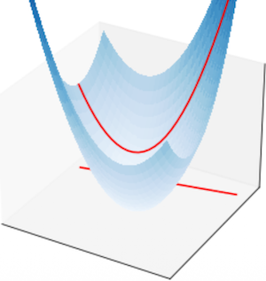

만약 단면 함수가 $\mathbf{v}^\top\mathbf{H}\mathbf{v} > 0 \text{ for }  \mathbf{v} \neq 0$ 이면, $\mathbf{H}$ 는 대칭이면서 **positive definite**( 모든 고유값 $>0$ )인 행렬이다. ( $\mathbf{H} \succ 0$ )

> 단면 함수가 $\mathbf{v}^\top\mathbf{H}\mathbf{v} \ge 0 \text{ for }  \mathbf{v} \neq 0$ 이면(평평한 방향도 포함), $\mathbf{H}$ 는 **positive semidefinite**(PSD, 모든 고유값 $\ge 0$)인 행렬이다. ( $\mathbf{H} \succeq 0$ )

Hessian의 고유값 분포(스펙트럼)에 따라 **stationary point**(기울기가 0인 점)의 정체는 다음과 같다.

| $\mathbf{H}$ spectrum | stationary point | 비고 |
|:---|:---|:---|
| Positive definite ( 모두 $>0$ ) | local minimum | - |
| Negative definite ( 모두 $<0$ ) | local maximum | 실제 학습에서는 드묾 |
| 고유값 양,음 혼재 | **saddle point**(안장점) | 고차원에서 훨씬 흔함 |
| PSD이지만 일부 고유값 $=0$ | 판별 불가 (min/max/둘 다 아님) | 고차 항이 결정 (e.g., $y=x^4$ vs $y=-x^4$) |

> **Note**: $y=x^4$ vs $y=-x^4$ 사례
>
> 고유값이 0이라면(평평하다면), 앞서 2차 테일러 근사에서 세 번째 항도 0이다. 그러므로 나머지 오차 항으로 판별해야 한다.
>
> - $x^4$ : 실제 정체는 minimum vs. $y=-x^4$ : 실제 정체는 maximum.
>
> 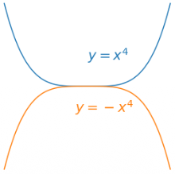

---

## 2.3 Gradient Descent Dynamics near Stationary Points

stationary point $\mathbf{w} _\star$ 근처에서 2차 테일러 근사를 취하면, $\nabla\mathcal{J}(\mathbf{w} _\star)=\mathbf{0}$ 이므로 1차 항이 사라진다. 이때 정확히 (Lecture 1와 같은) <U>convex quadratic 문제가 된다</U>. (Hessian 분석의 의의)

$$\mathcal{J}(\mathbf{w}) \approx \mathcal{J}(\mathbf{w}_\star) + \frac{1}{2}(\mathbf{w} - \mathbf{w}_\star)^\top\mathbf{H}(\mathbf{w} - \mathbf{w}_\star)$$

따라서 Lecture 1의 gradient descent에서 구한 해를 $\mathbf{A} \to \mathbf{H}$ 로 그대로 이식할 수 있다 

- 행렬 형태(왼쪽)와, 고유기저 좌표별 형태(오른쪽)

$$\mathbf{w}^{(k)} = \mathbf{w}_\star + (\mathbf{I} - \alpha\mathbf{H})^k(\mathbf{w}^{(0)} - \mathbf{w}_\star), \qquad \tilde{w} _i^{(k)} = \tilde{w} _{i\star} + (1 - \alpha\tilde{h} _i)^k(\tilde{w} _i^{(0)} - \tilde{w} _{i\star})$$

> **Note**: $\mathbf{w}^{(k)} - \mathbf{w}_\star$ 으로 이항하면?
>
> 최적 해까지 남은 거리(오차) = 초기 오차에 행렬 $(\mathbf{I} - \alpha\mathbf{H})$ 를 $k$ 번 곱한 값으로 이해할 수 있다.

---

### 2.3.1 Convergence Analysis

$\tilde{h} _i$ 의 부호에 따라 수렴/발산 여부를 나눌 수 있다. (Lecture 1과 유사)

**Case 1**: $\tilde{h} _i > 0$ **(Local minimum 근방)**. 안정 조건은 $\alpha < 2\tilde{h} _{\max}^{-1}$ 이다.

즉, <U>가장 큰 곡률(최대 고유값)이 가능한 학습률을 결정한다</U>. 

- 각 고유방향의 수렴 속도는 $\tilde{h} _j$ 에 비례한다. (고곡률 방향: 빠르게 수렴)

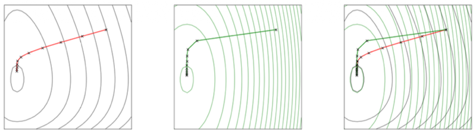

> 단, 저곡률 방향의 느린 수렴이 반드시 나쁜 것은 아니다. (해당 방향에 유용한 signal이 얼마나 담겨 있는지가 중요)

**Case 2**: $\tilde{h} _i < 0$ 인 음의 곡률 존재 **(Saddle point 근방)**. $|1 - \alpha\tilde{h} _i| > 1$ 이므로 안장점에서 멀어지게 된다.

다시 말해 gradient descent는 안장점에서 스스로 탈출하므로, <U>실전 신경망 학습에서 안장점은 대체로 병목이 아니다</U>.

| 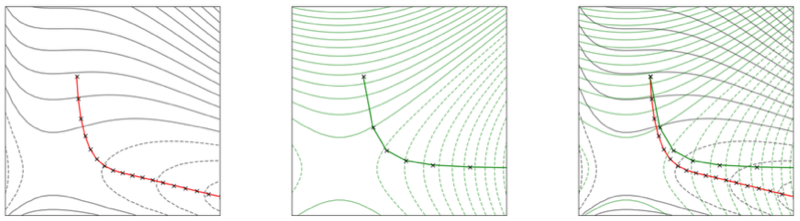 | 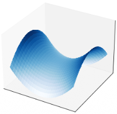 |
| --- | --- |

> 앞서 $\mathbf{w}^{(k)} - \mathbf{w}_\star$ 가 안장점까지의 거리이며, 줄어들지 않고 늘어나므로 결국 멀어지게 된다. (아래 휘는 방향으로 굴러 떨어진다.)

> **Note**: 예외는 대칭적 초기화(symmetric initialization)이며, Newton's method 같은 다른 optimizer는 안장점에 갇힐 수 있다. (Lecture 4)

---

## 2.4 Hessian Spectra of Real Neural Networks

> [An Investigation into Neural Net Optimization via Hessian Eigenvalue Density 논문(2019)](https://arxiv.org/abs/1901.10159)

그러나, 파라미터가 $D$ 개면 Hessian은 $D \times D$ 으로 엄청난 비용이 발생한다. 따라서, (JVP와 마찬가지로) Hessian도 **행렬-벡터 곱**(**Hessian-vector product**, HVP) 형태로 활용한다.

$$g(\mathbf{w}) = \nabla \mathcal{J}(\mathbf{w})$$

즉, $\mathbf{H}$ 은 gradient의 Jacobian이다. HVP는 가중치에 perturbation을 더한 이후, 기울기의 변화로 알 수 있다. (JVP는 비용의 변화였다.)

> **Note**:
>
> - 곡률은 $\dfrac{\mathbf{v}^\top\mathbf{H}\mathbf{v}}{\|\mathbf{v}\|^2}$ 이었다. 따라서, $\mathbf{v}$ 와  $\mathbf{H}\mathbf{v}$ 를 내적하면 곡률을 알 수 있다.
>
> - 가장 가파른 방향(**최대 고유값**): 고유값을 $k$ 제곱으로 증폭하면 최대 고유값만 생존한다. ( $\mathbf{H^kv}$ , **power iteration**)
>
> - 스펙트럼: 무작위 $\mathbf{v}$ 에서 구한 $\mathbf{v}^\top\mathbf{H}^k\mathbf{v}$ 를 평균하는 방식으로 추정 (**stochastic Lanczos quadrature**)

> **Note**: $\mathbf{H^kv}$ (power iteration)
>
> $\mathbf{Hv}$ 를 정규화( $\mathbf{u} \leftarrow \mathbf{v}/\|\mathbf{v}\|$ ) 하고, 다시 HVP를 반복하면 된다. (비용: forward pass의 약 $2k$ 배)

다음은 **stochastic Lanczos quadrature**를 활용해 ResNet-32의 Hessian 스펙트럼을 추정한 그래프다. (파란색: step 0, 빨간색: step 400)

- 학습 초기(파란색): 큰 음의 고유값 존재

- 학습 진행(빨간색): 음의 고유값이 사라지고, 대부분 0 근처로 몰리게 된다.

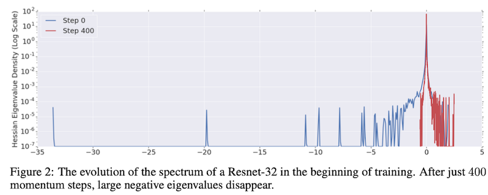

그러나, 해당 방법으로는 0 근처 고유값의 세밀한 분포(작은 값 vs 극도로 작은 값)를 알기 어렵다. (문제는 학습 동역학에서 바로 해당 정보가 중요하다.)

---

## 2.5 Example: Weak Symmetry Breaking in Regularized Linear Autoencoders

> [Regularized Linear Autoencoders Recover the Principal Components, Eventually 논문(2020)](https://arxiv.org/abs/2007.06731)

Hessian 분석을 사용하면, 비용 함수가 수렴했을 때 **정말 학습이 끝난 것인지**를 판별할 수 있다.

> **Note**: 또한, Hessian 분석은 수학적으로는 (local) optimum 근처에서만 정당화되지만, <U>테일러 근사가 정확하지 않은 영역에서도 유용한 통찰을 준다.</U>

설명을 위해선 '정답이 명확한 실험'을 활용해야 하는데(수렴했을 때 정답인가?), **linear autoencoder**가 바로 해당 예제로 적합하다. 

- **Autoencoder**: 입력을 저차원으로 압축했다가(encoder), 다시 복원하도록(decoder) 학습

- 즉, 정답은 입력 $\mathbf{x}$ 그 자체이다.

- 비용 함수(squared error loss)

$$ \mathcal{L}(\mathbf{x}, \tilde{\mathbf{x}}) = \frac{1}{2}\|{\mathbf{x}} - \tilde{\mathbf{x}}\|^2 $$

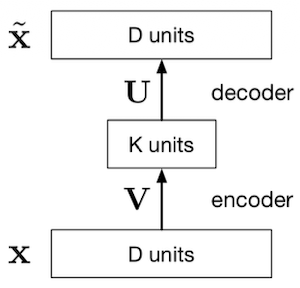

> 하나의 hidden layer + linear activations로 구성된 모델을 예시로 살펴본다.

다음은 encoder $\mathbf{z} = \mathbf{W}_1\mathbf{x}$ ( $K$ 차원 bottleneck )와 decoder $\hat{\mathbf{x}} = \mathbf{W}_2\mathbf{z}$ 를 비용 함수에 대입한 수식이다.

$$\frac{1}{2N}\sum_{i=1}^{N}\|\mathbf{W}_2\mathbf{W}_1\mathbf{x}^{(i)} - \mathbf{x}^{(i)}\|^2$$

---

### 2.5.1 Setup: Linear Autoencoders and the PCA Ground Truth

> [Taeyang Yang: Principal component analysis](https://tyami.github.io/machine%20learning/PCA/)

linear autoencoder의 encoder는 압축, 즉 '무엇을 버릴 것인가'를 결정한다. 그리고 square error로 학습할 때, 최적해는 **PCA**(principal component analysis)와 동치임이 알려져 있다.

> **Note**: **PCA**(주성분 분석) - 여기서 성분은 방향(고유벡터)을 의미
>
> 데이터(feature)를 압축할 때, 분산이 제일 커지는 방향(아래 그림의 대각선)으로 projection한다. (이어서는 '해당 축과 직교하는 축에서 분산이 최대가 되는 축'을 선택 - 상위 $K$ 개 반복)
>
> 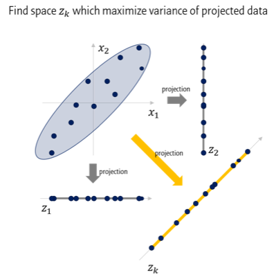

> **Note**: lecture 1(1.9절 Case 2)과의 연관성 (고유값을 empirical mean, empirical covariance로 분석)
>
> - 최적 부분공간 = empirical covariance 행렬의 상위 $K$ 개 고유벡터가 span하는 부분공간 (**principal subspace**, 주부분공간)

하지만, 이것만으로는 해가 유일하지 않다(**대칭성**). 예를 들어 임의의 가역 행렬을 encoder와 decoder에 곱해준다고 하자.

$$\mathcal{T}_{\mathbf{A}}(\mathbf{W}_1, \mathbf{W}_2) = (\mathbf{A}\mathbf{W}_1, \mathbf{W}_2\mathbf{A}^{-1})$$

비용 함수에 대입해도 $(\mathbf{W}_2\mathbf{A}^{-1})(\mathbf{A}\mathbf{W}_1)=\mathbf{W}_2\mathbf{W}_1$ 이므로, 비용 함수에 미치는 영향이 없다. 따라서 정답을 하나로 강제할 수 없기 때문에, 다음과 같은 **non-uniform** $\ell_2$ 정규화가 필요하다.

- 대각 행렬 $\mathbf{\Lambda}$ : 직접 정하는 하이퍼파라미터이며, 각 대각 원소에 다른 정규화 강도 $\lambda$ 를 둔다. (총 $K$ 개)

- 정규화 패널티가 가장 작은 열에, (가중치가 큰) 1등 주성분을 배정하는 것이 최적이다. (결국 순서대로 정렬된다.)

$$\frac{1}{2N}\sum_{i=1}^{N}\|\mathbf{W}_2\mathbf{W}_1\mathbf{x}^{(i)} - \mathbf{x}^{(i)}\|^2 + \frac{1}{2}\|\mathbf{\Lambda}^{1/2}\mathbf{W}_1\|_F^2 + \frac{1}{2}\|\mathbf{W}_2\mathbf{\Lambda}^{1/2}\|_F^2$$

이렇게 non-uniform $\ell_2$ 정규화를 추가하는 것으로, 비로소 유일한 정답을 강제하는 문제가 되었다.

---

### 2.5.2 The Puzzle: Cost Converges, but the Solution Doesn't

하지만 정작 경사 하강법으로 최적화를 수행하면, encoder 가중치 행렬의 각 열이 정답(각 주성분) 각도로 정렬되기 전에 비용이 먼저 수렴한다.

- **(위)** Cost: iter에 따른 비용 (수백 iteration만에 수렴)

- **(아래)** Angle: iter에 따른 $\mathbf{W}_1$ 의 각 열과 해당 주성분 사이의 각도 (수십만 iteration이 지나도 느리게 감소)

| 1,000 iterations | 100,000 iterations |
| :---: | :---: |
| 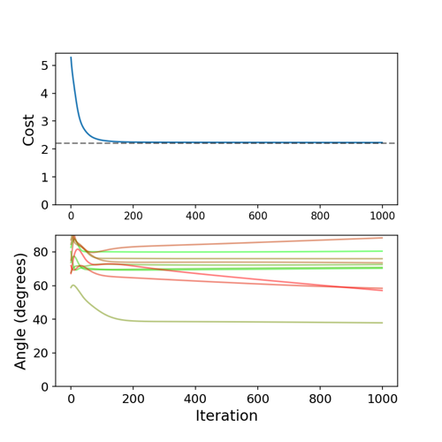 | 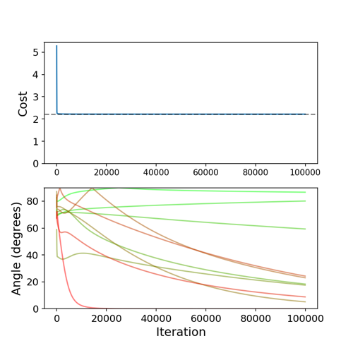 |

그렇다면 왜 이처럼, **비용의 수렴이 해의 수렴을 보장하지 않은 것일까?**

---

### 2.5.3 Diagnosis: Measuring Directional Curvature at the Optimum

앞서 대칭성을 무한히 많은 해의 원인(평평한 평면)으로 지적하였다. 그런데, 유일한 해로 강제하는 유일한 변환이 **rotation**(회전)이라면 정규화가 비용 함수에 미치는 영향도 매우 작을 수밖에 없다. 

> 가설: 정규항이 만들어내는 곡률이 너무 약해서, gradient descent가 대칭을 실제로 깨는 데 오랜 시간이 걸린다.

다음은 실제 linear autoencoder의 최적점에서, 두 종류의 변환에 해당하는 방향 벡터에서의 곡률(Rayleigh quotient, HVP로 계산)을 실제로 계산한 도표다.

- rescaling: 최적점에서 가중치의 스케일 변화가 어느 정도의 곡률 값을 갖는지 보여주는 대조군

- rotation: rescaling에 비해 <U>곡률이 약 3000배나 더 작다</U>.

| 변환 | 변환 함수 | Rayleigh quotient |
|:---:|:---|:---:|
| Rescaling | $\mathcal{T} _\gamma(\mathbf{W} _1, \mathbf{W} _2) = (\gamma\mathbf{W} _1, \gamma\mathbf{W} _2)$ | $\approx 1.36$ |
| **Rotation** | $\mathcal{T} _\theta(\mathbf{W} _1, \mathbf{W} _2) = (\mathbf{Q} _\theta\mathbf{W} _1, \mathbf{W} _2\mathbf{Q} _\theta^\top)$ | $\approx 0.00042$ |

> $\mathbf{Q}_\theta$ (**Givens rotation**): 선택한 2개 좌표축이 이루는 평면만을 $\theta$ 라디안 회전시키는 직교 행렬

정리하자면 수렴 속도는 곡률에 비례하지만, 주성분 정렬이 저곡률의 회전 변환으로 이루어질 경우 극도로 수렴이 느려지게 된다. 이 현상을 **weak symmetry breaking**(약한 대칭 깨짐)이라 부른다.

다음은 손실 평면을 실제로 시각화한 그림이다. (바닥: 가중치 구성, 세로축: 비용)

- 반지름 방향: 가중치의 전체 크기(rescaling)가 변화하며 가파르다. (가중치 값이 0인 중앙이 제일 높음)

- latent 회전 방향: 반지름 크기가 일정한 평평한 평면을 돌게 된다. (비용 변화 거의 없음)

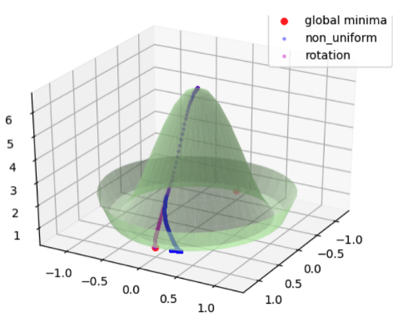

---

### 2.5.4 Summary

linear autoencoder 예시에서, (가설에 대한) <U>HVP를 바탕으로 한 검증으로 정말 학습이 잘 이루어졌는지 진단할 수 있었다</U>.

- 수렴 완료 $\neq$ 학습 완료: 저곡률 방향으로의 학습이 충분히 이루어졌는지 알 수 없다.

- 실제 학습의 병목: 수렴 조건(최대 곡률, 학습률 상한)만이 아니라, **0에 가까운 곡률**도 영향을 미친다.

---