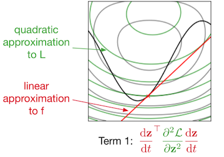
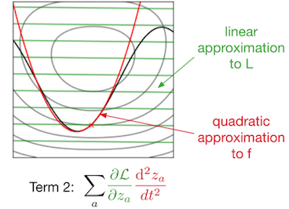
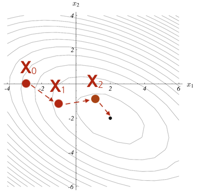
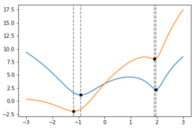
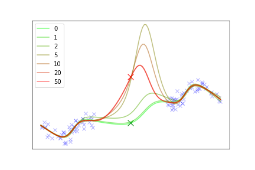

# 2. Taylor Approximations

Hessian은 분석에 있어서 중심 도구이지만, 두 가지 결함이 존재한다.

| No. | Case | Description |
| :---: | --- | --- |
| **(1)** | <U>PSD가 아닌 경우</U>(음의 고유값 가능) | Newton's method: 음의 고유값이 있다면 안장점으로 끌려갈 수 있다.(Lecture 4)<br>conjugate gradient(2.7절) 불가: PSD가 전제되어야 한다. |
| **(2)** | <U>활성화 함수의 2차 미분이 무의미한 경우</U> | 예를 들어, ReLU의 2차 미분은 0이거나 계산할 수 없으므로 곡률 정보가 무의미하다. |

Hessian이 필요하지만 사용할 수 없는 경우에는 **Gauss-Newton Hessian**(2.6절)을 사용한다.

> e.g., [Hessian-free optimization](https://www.cs.toronto.edu/~jmartens/docs/Deep_HessianFree.pdf)(Lecture 4): GN-HVP(2.6절) + Conjugate Gradient(2.7절)

---

## 2.6 Gauss-Newton Hessian

분류 문제에서의 비용 함수 $\mathcal{J}$ 가 있다고 하자.

- $\mathbf{z} = f(\mathbf{w}, \mathbf{x})$ : 분류 logits ( $f$ : 네트워크 함수 )

- $\mathcal{L}(\mathbf{z}, \mathbf{t})$ : **squared error**(혹은 **softmax-cross-entropy**) 손실

$$\mathcal{J} = \mathcal{L}(f(\mathbf{w},\mathbf{x}), \mathbf{t})$$

비용 함수 $\mathcal{J}$ 를 이차 미분하면 Hessian $\nabla^2 \mathcal{J} _{\mathbf{x},\mathbf{t}}(\mathbf{w})$ 을 얻을 수 있다.

> **Note**: 이차 미분의 다변수 버전
>
> $$\mathcal{J}''(w) = {\mathcal{L}''(f(w)) \cdot f'(w)^2} + {\mathcal{L}'(f(w)) \cdot f''(w)}$$
>
> $f' \to \mathbf{J} _{\mathbf{zw}}$ , $\mathcal{L}'' \to \mathbf{H} _{\mathbf{z}}$ 로 치환하면 Hessian 버전의 수식을 얻을 수 있다.

다음은 Hessian을 이차 미분 공식에 따라 decomposition한 수식이다. ${\partial \mathcal{L}}/{\partial \mathbf{z}} \approx \mathbf{0}$ 이면, <U>즉 학습이 잘 되면 두 번째 항은 무시(drop)</U>할 수 있다.

- $\mathbf{H} _{\mathbf{z}} = \nabla^2 _{\mathbf{z}}\mathcal{L}(\mathbf{z}, \mathbf{t})$ : **output Hessian**(출력 공간에서의 Hessian)

- $\mathbf{G} = \mathbf{J} _{\mathbf{zw}}^\top \mathbf{H} _{\mathbf{z}} \mathbf{J} _{\mathbf{zw}}$ : **Gauss-Newton Hessian**(generalized Gauss-Newton)

$$\nabla^2 \mathcal{J}_{\mathbf{x},\mathbf{t}}(\mathbf{w}) = \underbrace{\mathbf{J}_{\mathbf{zw}}^\top \mathbf{H}_{\mathbf{z}} \mathbf{J}_{\mathbf{zw}}}_{\text{Gauss-Newton Hessian}} + \underbrace{\sum_a \frac{\partial \mathcal{L}}{\partial z_a} \nabla^2_{\mathbf{w}}[f(\mathbf{x}, \mathbf{w})]_a}_{\text{drop}}$$

다음은 출력 공간(output space)에서 두 항이 어떤 모양인지를 보여주는 그림이다. 

- 회색 등고선: $\mathcal{L}(\mathbf{z})$ 

- 검은색 곡선: $\mathbf{z} = f(t)$

| ${\mathcal{L}''(f(t))}$ (초록색) $\cdot$ ${f'(t)^2}$ (빨간색^2) | ${\mathcal{L}'(f(t))}$ (초록색) $\cdot$ ${f''(t)}$ (빨간색) |
| :---: | :---: |
|  |  |
| **GN-Hessian** | 음의 고유값을 가질 수 있으며, $\mathbf{z}$ 가 최적해일 땐 항이 사라진다(drop) |

핵심은 GN-Hessian이 (분석할 수 있는 한도 내에서 절충하듯) 손실 함수의 2차 정보(곡률)와, 네트워크의 1차 정보를 취한다는 점이다. (저차원이고 볼록한 손실에서는 곡률을 취하고, 고차원이며 볼록하지 않은 $f$ 에서는 1차 정보만을 취한다.)

무엇보다 손실 함수(squared error, softmax-cross-entropy)는 convex하므로 output Hessian $\mathbf{H} _{\mathbf{z}}$ 는 PSD를 만족한다. 자연스럽게 <U>GN-Hessian도 PSD를 만족</U>한다. (행렬 $\mathbf{A}$ 가 PSD라면 $\mathbf{B}^\top \mathbf{A} \mathbf{B}$ 형태에서도 PSD는 보존된다.)

---

### 2.6.1 Some Notes/Gotchas on GN-Hessian

**(1)** ${\partial \mathcal{L}}/{\partial \mathbf{z}}$ 가 0에 가깝지 않아도 GN-Hessian은 여전히 유효하다. **A.** 최적화의 국소성에 따라 $f \approx f_{\text{lin}}$ 이 성립하며, **B.** $\mathcal{L}(f_{\text{lin}})$ 의 Hessian이 바로 GN-Hessian이기 때문이다.

$$ f_{\text{lin}}(\mathbf{w}', \mathbf{x}) = f(\mathbf{w}, \mathbf{x}) + \mathbf{J}_{\mathbf{zw}}(\mathbf{w}' - \mathbf{w})$$

$$\mathcal{J}_{\text{lin}}(\mathbf{w}') = \mathcal{L}(f_{\text{lin}}(\mathbf{w}', \mathbf{x}), \mathbf{t})$$

$\mathbf{w}'$ 관점에서 $f(\mathbf{w}, \mathbf{x})$ 와 $\mathbf{J_{zw}}$ 는 상수이므로 $f_{\text{lin}}(\mathbf{w}', \mathbf{x})$ 는 1차 함수다. 그러므로 앞서 decomposition 수식에서 $f''=0$ 을 대입하면 오른쪽 항은 제거된다.

<br>

**(2)** 'Gauss-Newton'이란 용어는 종종 **squared error** 알고리즘 한정으로 쓰인다.

- 이때는 $\mathbf{H} _{\mathbf{z}} = \mathbf{I}$ 이며, 결과적으로 $\mathbf{G} = \mathbf{J} _{\mathbf{zw}}^\top\mathbf{J} _{\mathbf{zw}}$ 가 된다. 

<br>

**(3)** logits을 '확률로 정규화한 값'이 아닌, **logits** 자체를 출력으로 분석해야 함에 주의한다.

<br>

**(4)** HVP와 달리(HVP: autodiff 1회로 획득), GN HVP는 순차적인 계산이 필요하다.

- 괄호대로 오른쪽부터: $\mathbf{J} _{\mathbf{zw}} \mathbf{v}$ (JVP 1회) $\rightarrow$ $\mathbf{H} _{\mathbf{z}}(\cdot)$ (출력 공간은 저차원이므로 비용 적음) $\rightarrow$ $\mathbf{J} _{\mathbf{zw}}^\top(\cdot)$ (VJP 1회)

$$\mathbf{G}\mathbf{v} = \mathbf{J}_{\mathbf{zw}}^\top \big( \mathbf{H}_{\mathbf{z}} ( \mathbf{J}_{\mathbf{zw}} \mathbf{v} ) \big)$$
 
---

## 2.7 Solving Linear Systems with Conjugate Gradient

> [An Introduction to the Conjugate Gradient Method Without the Agonizing Pain 논문(1994)](http://luthuli.cs.uiuc.edu/~daf/courses/Opt-2017/Papers/painless-conjugate-gradient.pdf)

이후 강의에서는 여러 공식에 있는 '역행렬 $\times$ 벡터' 식( $\mathbf{A}^{-1}\mathbf{b}$ )을 풀어야 한다. 그런데 작은 toy 예제가 아닌 한, 역행렬은 고사하고 $\mathbf{A}$ (= $\mathbf{H}$ 또는 $\mathbf{G}$ )를 얻기도 어렵다.

- response Jacobian $-[\nabla^2_{\mathbf{w}}\mathcal{J}]^{-1}\nabla^2_{\mathbf{w}\boldsymbol{\theta}}\mathcal{J}$ (2.8절)

- Newton method $\Delta\mathbf{w} = -\mathbf{H}^{-1}\nabla\mathcal{J}$ (Lecture 4)

주목할 부분은, '**linear system**(선형계) $\mathbf{A}\mathbf{x} = \mathbf{b}$ 를 만족하는 해  $\mathbf{x}$ 찾기' 문제로 정의해도 무방하다는 점이다. 다시 말해, 다음과 같은 <U>이차 함수 형태의 비용 함수를 최적화하는 문제와 동일</U>하다.

$$\mathcal{J}(\mathbf{x}) = \frac{1}{2}\mathbf{x}^\top\mathbf{A}\mathbf{x} - \mathbf{b}^\top\mathbf{x}$$

- 기울기(1차 미분): $g(\mathbf{x}) = \mathbf{A}\mathbf{x} - \mathbf{b}$

- **기울기가 0이 되는 지점**이 정확히 $\mathbf{A}\mathbf{x} = \mathbf{b}$ 의 해다. ( $\mathbf{A}$ 가 PSD면 convex이므로, 기울기가 0인 지점이 최솟점이다. Lecture 1)

최소화 문제이므로 경사 하강법을 활용할 수 있으며, gradient 1회 계산 = MVP 1회 비용만 필요하다.

$$\mathbf{x}^{(k+1)} \leftarrow \mathbf{x}^{(k)} - \alpha(\mathbf{A}\mathbf{x}^{(k)} - \mathbf{b})$$

그러나 경사 하강법의 반복해는 **작은 고유값 방향에서** $O(\kappa)$ **로 느리게 수렴**했다.(Lecture 1) 

---

### 2.7.1 Exact Line Search

적어도 경사 하강법에서 <U>얼마나 보폭을 조정해야 하는지</U>는 알 수 있다. ( **방향** $\mathbf{p} _k$ x **보폭** $\alpha_k$ )

<table>
<tr>
<td>

**Example**

</td>
<td>

**Position**

</td>
</tr>
<tr>
<td>



</td>
<td>

```math
\mathbf{x} _0 = \begin{bmatrix} -3 \\ 0 \end{bmatrix} \rightarrow \mathbf{x} _1 = \begin{bmatrix} -1 \\ -1 \end{bmatrix} \rightarrow \mathbf{x} _2 = \begin{bmatrix} \cdots \\ \cdots \end{bmatrix}
``` 

```math
\mathbf{x} _{k+1} = \mathbf{x} _ k + \alpha _k \mathbf{p} _k
```

</td>
</tr>
</table>

**exact line search**란, 현재 위치 $\mathbf{x}$ 에서 정해진 방향 $\mathbf{p}$ 을 보았을 때, 나아갈 최적의 보폭을 찾는 절차다.( $\mathbf{x}$ 와 $\mathbf{p}$ 는 상수, 변수는 $\alpha$ 하나뿐)

$$\alpha_\star = \arg\min_\alpha \mathcal{J}(\mathbf{x} + \alpha\mathbf{p})$$

- 방향 $\mathbf{p}$ 에서 단면 함수 $g(\alpha) \equiv \mathcal{J}(\mathbf{x} + \alpha\mathbf{p})$ 는 다음과 같다. (앞서 정의한 손실 대입)

$$g(\alpha) = \mathcal{J}(\mathbf{x}) + \alpha\, \mathbf{p}^\top(\mathbf{A}\mathbf{x} - \mathbf{b}) + \tfrac{1}{2}\alpha^2\, \mathbf{p}^\top\mathbf{A}\mathbf{p}$$

수식을 보면 단면이 정확히 포물선임을 알 수 있다. 따라서, 최솟점(최적의 보폭)은 $g'(\alpha_\star) = 0$ 으로 얻을 수 있다.

$$\alpha_\star = \frac{-\mathbf{p}^\top(\mathbf{A}\mathbf{x} - \mathbf{b})}{\mathbf{p}^\top\mathbf{A}\mathbf{p}}$$

> **Note**: 필요한 계산은 $\mathbf{Ap}$ (MVP)와 두 번의 내적뿐이다.

exact line search에서 가져야 할 직관은 두 가지다.

- $\mathbf{x} _{k+1} = \mathbf{x} _ k + \alpha _k \mathbf{p} _k$ 로 이동을 마쳤다고 하자. (최솟점이므로) 현 시점에서 $\mathbf{p} _k$ 방향으로는 더 이상 최소화할 수 없다.

- 따라서, 경사 하강법의 다음 방향은 $\mathbf{g} _{k+1} \perp \mathbf{p} _k$ 을 만족한다.

- 문제는, $\mathbf{g} _{k+2}$ 에서, 2스텝 전의 $\mathbf{p} _k$ 방향으로 다시 나아갈 수 있다. ( $\mathbf{g} _{k+1}$ 로 나아갈 때 $\mathbf{p} _k$ 방향의 성분이 부활하기 때문. 2.7.2절)

실제로 경사 하강법은 좁은 계곡에서 소수의 방향을 지그재그로 재방문하며 $O(\kappa)$ 의 비용이 필요하다.

---

### 2.7.2 Conjugate Directions

그렇다면 과거에 이미 최적화를 끝낸 방향 $\mathbf{d}$ 를 재방문하지 않으려면 어떻게 해야 할까? 다음은 기울기 수식이다.

$$\mathbf{g} = \mathbf{A}\mathbf{x} - \mathbf{b}$$

- 위치 $\mathbf{x}$ 가 $\alpha\mathbf{p}$ 만큼 이동한다면, 기울기 변화량은 $\alpha\mathbf{A}\mathbf{p}$ 이다.

$$\mathbf{d}^\top(\mathbf{g} + \alpha\mathbf{A}\mathbf{p}) = \underbrace{\mathbf{d}^\top\mathbf{g}}_{=0} + \alpha\,\mathbf{d}^\top\mathbf{A}\mathbf{p}$$

> line search에 의해 직전 방향으로는 더이상 최적화 여지가 없다. ( $\mathbf{d}^\top\mathbf{g} = 0$ )

핵심은 $\mathbf{d}$ 방향의 성분이 정확히 $\alpha\,\mathbf{d}^\top\mathbf{A}\mathbf{p}$ **만큼 부활**한다는 점이다. **Conjugate Gradient**(CG)는 매 업데이트의 방향이 $\mathbf{A} \mathbf{p} _{k-1}$ 과 직교하도록 강제하여 <U>직전 성분의 부활을 방지</U>한다. (이를 conjugacy 조건으로 정의)

$$\mathbf{p}_k^\top \mathbf{A}\, \mathbf{p}_{k-1} = 0$$


> **Note**: 내적을 $\mathbf{u}^\top\mathbf{A}\mathbf{v}$ 로 정의한 버전의 Gram-Schmidt Orthogonalization로 이해할 수 있다.

> **Note**: 방향 $\mathbf{p} _k = -\mathbf{g} _k + \beta\, \mathbf{p} _{k-1}$ 에서 $\beta_k$ 정의
>
> $$\mathbf{p}_k^\top \mathbf{A}\, \mathbf{p}_{k-1} = 0$$
>
> - 방향 식을 대입하고 수식 전개
>
> $$-\,\mathbf{g}_k^\top \mathbf{A}\, \mathbf{p}_{k-1} \;+\; \beta\; \mathbf{p}_{k-1}^\top \mathbf{A}\, \mathbf{p}_{k-1} = 0$$
>
> - 변수는 $\beta$ 하나뿐이고, 나머지 항은 모두 스칼라인 일차방정식이다.
>
> $$\beta_k = \frac{\mathbf{g}_k^\top \mathbf{A}\, \mathbf{p}_{k-1}}{\mathbf{p}_{k-1}^\top \mathbf{A}\, \mathbf{p}_{k-1}}$$

정리하자면 $\mathbf{A}$ 가 대칭이며 PSD라면 일반 경사 하강법 대신, 동일한 비용(iteration당 MVP 1회)이지만 훨씬 빠른 **Conjugate Gradient**(CG)를 활용할 수 있다. 

> **Note**: 다음을 만족하면 nonzero 벡터들 $\{ \mathbf{p} _0, \mathbf{p} _1, \ldots , \mathbf{p} _k \}$ 이, 대칭이며 positive definite인 행렬 $\mathbf{A}$ 에 대해 서로 **conjugate**하다.
>
> $$ \mathbf{p}_i^\top \mathbf{A} \mathbf{p}_j = 0 \quad (\text{for all} \ i \neq j) $$

---

### 2.7.3 Krylov Subspace

앞서 경사 하강법에서 업데이트마다 부활하는 성분을 알았다.

$$\mathbf{g}_{j+1} = \mathbf{g}_j + \alpha_j \mathbf{A}\mathbf{p}_j$$

즉, $k$ 스텝 동안 기울기는 $\mathbf{b}, \mathbf{A}\mathbf{b}, \ldots, \mathbf{A}^{k-1}\mathbf{b}$ 으로 구성된다.( $\mathbf{x} _0 = \mathbf{0}$ 가정 ) 정리하자면 모든 반복해 $\mathbf{x}^{(k)}$ 는 이들이 span하는 **Krylov subspace**에 속한다.

$$\mathcal{K}_k(\mathbf{A}, \mathbf{b}) = \text{span}\{\mathbf{b}, \mathbf{A}\mathbf{b}, \ldots, \mathbf{A}^{k-1}\mathbf{b}\}$$

> **Note**: **Krylov subspace**
>
> MVP를 $k$ 번 쓴 알고리즘이 도달할 수 있는 모든 영역(집합). CG만이 아니라 GD, momentum GD를 포함한 **모든 MVP 기반 알고리즘의 공통 제약**이다.

어떤 MVP 기반 알고리즘도 다음 하한을 넘을 수 없다.

$$\mathcal{J}(\mathbf{x}^{(k)}) \geq \min_{\mathbf{x} \in \mathcal{K}_k(\mathbf{A},\mathbf{b})} \mathcal{J}(\mathbf{x})$$

그리고 CG가 바로 이 하한을 정확히 달성하는 효율적인 알고리즘이다.

| Algorithm | Convergence Rate | \#MVP/iteration |
|:---:|:---:|:---:|
| Gradient descent | $O(\kappa)$ | 1 |
| **Conjugate gradient** | $O(\sqrt{\kappa})$ | 1 |

---

## 2.8 Example: Sensitivity to Dataset Perturbations

> [Understanding Black-box Predictions via Influence Functions 논문(2017)](https://arxiv.org/abs/1703.04730)

Hessian, GN-Hessian, CG를 모두 활용하는 분석 예제를 살펴보자. '학습 데이터를 살짝 바꾸면 결과가 어떻게 달라질까'라는 의문을 해결할 것이다. 

> (1) 예제의 중요도를 파악(influence functions)하거나, (2) 잘못 레이블한 데이터를 식별하거나, (3) 변조/공격(data poisoning)을 분석하는 등 다양한 도메인에서 필요하다.

다음은 **response function**(rational reaction function)이다. 문제 설정 $\boldsymbol{\theta}$ 를 바꾸면 해가 어떻게 달라지는가 규칙 $r$ 으로 식을 정의한다. (이때 가중치 $\mathbf{w}$ 는 argmin에 의해 자동으로 정의되는 값이다.)

- $\boldsymbol{\theta}$ : 데이터(혹은 하이퍼파라미터)

$$\mathbf{w}_\star = r(\boldsymbol{\theta}) = \arg\min_{\mathbf{w}} \mathcal{J}(\mathbf{w}; \boldsymbol{\theta})$$

문제는 $r(\theta)$ 에 대한 명시적인 공식은 없다.( 조건 $\nabla_{\mathbf{w}}\mathcal{J} = \mathbf{0}$ 만 존재 ) 그럼에도 정의할 수 있는 이유는 **Implicit Function Theorem**(IFT, 음함수 정리)에 의해 보장되기 때문이다.

argmin으로 기울기가 0일 때를 조건( $F = \nabla_{\mathbf{w}}\mathcal{J}=0$ )으로 두었으므로, IFT의 첫 번째 조건 $F(\mathbf{w}, \boldsymbol{\theta}) = \mathbf{0}$ 을 만족한다. 이어서 $\partial F/\partial \mathbf{w}$ 가 가역이여야 한다는 두 번째 조건은, Hessian이 가역이어야 한다는 말과 동치다. (positive definite일 때 만족한다.)

> **Note**: **Implicit Function Theorem** (IFT, 음함수 정리)
>
> 방정식 $F(\mathbf{w}, \boldsymbol{\theta}) = \mathbf{0}$ 이 있고 $\partial F/\partial \mathbf{w}$ 가 가역이면,
>
> - (1) 국소적으로 조건을 만족하는 매끄러운 함수 $\mathbf{w} = r(\boldsymbol{\theta})$ 가 실제로 존재한다.
>
> - (2) 공식 없이도 도함수를 계산할 수 있다.

작은 섭동 $\Delta\boldsymbol{\theta}$ 의 효과는 **response Jacobian**(reaction Jacobian)으로 알 수 있다.

- mixed 항 $\nabla^2_{\mathbf{w}\boldsymbol{\theta}}\mathcal{J}$ : 섭동이 gradient를 얼마나 기울이는가

- inverse Hessian 항 $[\nabla^2_{\mathbf{w}}\mathcal{J}]^{-1}$ : 기울어진 gradient에 최적점이 얼마나 민감하게 반응하는가

$$\mathbf{J}_{\mathbf{w}_\star\boldsymbol{\theta}} = \frac{d r}{d\boldsymbol{\theta}} = -\left[\nabla^2_{\mathbf{w}} \mathcal{J}(\mathbf{w}; \boldsymbol{\theta})\right]^{-1} \nabla^2_{\mathbf{w}\boldsymbol{\theta}} \mathcal{J}(\mathbf{w}; \boldsymbol{\theta})$$

<U>곡률이 낮은(평평한) 방향일수록, 같은 섭동에서 최적 가중치가 크게 움직인다</U>. (2.5절에서 살핀 저곡률 개념이, 민감도 관점에서 다시 등장)

> **Note**
>
> - mixed 항: $\boldsymbol{\theta}$ 를 $\Delta\boldsymbol{\theta}$ 방향으로 살짝 변화시켰을 때 기울기 $\mathbf{g}$ 변화: JVP 1회
>
> - inverse Hessian 항: $[\nabla^2_{\mathbf{w}}\mathcal{J}]^{-1} \mathbf{b}$ 처럼 선형계 문제로 두고 CG로 최적화
>
> 단, 실전에서는 inverse Hessian 항을 GN-Hessian + damping(Lecture 4)으로 구한다.

---

### 2.8.1 Toy Example

다음 1차원 toy 비용 함수에서 민감도를 분석해 보자. 파란색 실선은 $\lambda =0$ 일 때의 가중치(x축)에 따른 비용(y축)을 나타낸다. (주황색: $\lambda = 3$ 으로 섭동을 준 경우)

$$\mathcal{J}(w;\lambda) = g(w) + \lambda w$$

- 점선의 간격이 섭동 전후 최솟점(검은 점)의 이동량이다. ( response Jacobian x $\Delta \lambda$ ) 

  - 왼쪽( $w \approx -1$ ) 평평한 골짜기: 점선 간격이 넓다.

  - 오른쪽( $w \approx 2$ )의 뾰족한 골짜기: 간격이 매우 좁다.



mixed 항( $w$ 로 한 번, $\lambda$ 로 한 번 미분 ) 계산 시 값은 1(상수)이다. 따라서 response Jacobian은 inverse Hessian 항( $w$ 로 두 번 미분 ) $-1/g''(w _{\star})$ 만 남는다.

즉, 각 최솟값에서 이차 미분(곡률)에 반비례하게 섭동에 대한 민감도가 결정된다.

> **Note**: 한 데이터 point를 옮겼을 때 fitted curve의 변화 (초록 × $\rightarrow$ 빨간 ×)
>
> 다음은 CG 반복 수(그래프의 라벨)에 따른 fitted curve(입력에 따른 출력)를 보여준다. (x축: 입력, y: 출력)
>
> - 0번째 반복(초록색 선): 원래의 곡선
>
> - 50번째 반복(빨간색 선): 더 이상 변하지 않는다.
>
> 
>
> 변화가 국소적이라는 사실에 주목하자. 옮긴 데이터 포인트 근처에서만 곡선이 크게 솟고 먼 곳은 거의 그대로이다. (한 데이터가 어디에 영향을 미치는지를 알 수 있다.)

---
