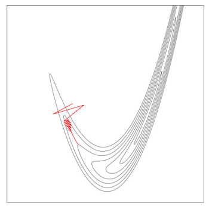
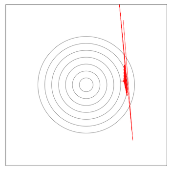
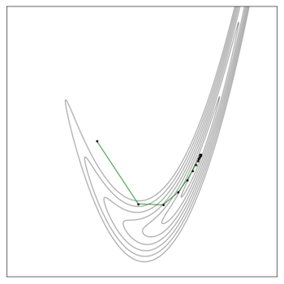
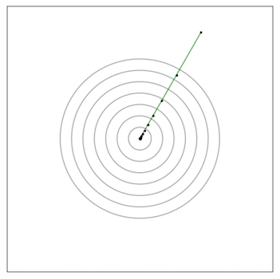
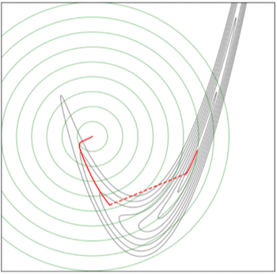
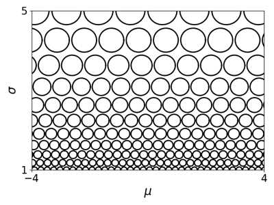

# 3. Metrics

업데이트 전 $\mathbf{w} ^{(k)}$ 와 업데이트 후 $\mathbf{w} ^{(k+1)}$ 는 <U>서로 다른 두 개의 신경망으로 볼 수 있다</U>. 이러한 관점에서 학습률의 선택을 '<U>한 번의 step으로 신경망을 얼마나 멀리 이동</U>시킬 것인가'라는 문제로 볼 수 있다.

일반적인 경사 하강법이 암묵적으로 전제하는 지표는 가중치 벡터의 유클리드 거리다. ( $\|\Delta\mathbf{w}\|$ 는 학습률에 비례 ) 문제는 업데이트의 '보폭'을 잴 때, 가중치 공간의 유클리드 거리는 옳은 척도가 아니다. 어떤 방향은 모델에 미치는 영향이 적은 반면에, 어떤 방향은 큰 영향을 미치기 때문이다.

---

## 3.1 Motivation: Why Not Weight Space?

> **Note**: 신경망이 아닐 땐, weight space 대신 parameter space로 지칭

유명한 toy 문제인 **Rosenbrock function**(로젠브록 함수)을 살펴보자.

$$h(x_1, x_2) = (a - x_1)^2 + b(x_2 - x_1^2)^2$$

위 함수를 $\mathcal{L} \circ f$ 구조로 분해하는 **composite optimization**(합성 최적화)를 통해 (비용 함수처럼) 분석할 수 있다.

$$\begin{aligned}
\mathcal{J}(x_1, x_2) &= \mathcal{L}(f(x_1, x_2)), \\
f(x_1, x_2) &= \big(a - x_1,\ \sqrt{b}(x_2 - x_1^2)\big), \\
\mathcal{L}(z_1, z_2) &= z_1^2 + z_2^2
\end{aligned}$$

다음은 경사 하강법에 따른 변화를 parameter space, output space에서 보여주는 그림이다.

- (param) 벽 방향으로 움직이면, (output) 너무 많이 튕긴다.

- (param) 골짜기 방향으로 움직이면, (output) 거의 변하지 않는다.

| parameter space | output space |
|:---:|:---:|
|  |  |
| 좁게 휘어진 골짜기(valley) | 완벽한 동심원 |

> **Note**: 왜 출력이 급격하게 변화하면 안되는가?
>
> 강화 학습, 미세조정, 지식 증류 등: 기존의 해와 너무 멀어지지 않도록 학습해야 한다. (문제는, 유클리드 거리만으로는 알기 어렵다.)

그렇다면 output space에서 경사 하강법을 수행하면 어떨까?

---

### 3.1.1 GD on Output Space

문제는 출력 $\mathbf{z}$ 은 (파라미터와 달리) <U>직접 조절할 수 있는 변수가 아니다</U>. 출력은 가중치 $\mathbf{w}$ 의 변화에 따라 결정되는 값이기 때문이다.

- 출력 공간에서 가중치를 최적화하려면 역함수 $\mathbf{w} = f^{-1}(\mathbf{z} ^{(k+1)})$ 를 획득해야 한다. 

- 그러나 신경망의 역함수는 존재할지 불분명하며, 있더라도 계산하기 어렵다.

그러므로 출력 공간에서의 경사하강법( $\mathbf{z} ^{(k+1)} = \mathbf{z} ^{(k)} - \alpha \nabla_{\mathbf{z}}\mathcal{L}$ )은 반칙(**cheating**)임에 주의하자.

| parameter space | output space |
|:---:|:---:|
|  |  |

그 대신, (반칙이 아닌) 파라미터 공간에서 비용 함수를 최적화하면서, 출력 공간에서의 변화량을 패널티로 참고하는 **proximal optimization** 아이디어로 이어진다.

---

## 3.2 Proximal Optimization

**proximal point method**은 최적화 과정에서 매 iteration의 거리 변화를 제약한다. $\mathrm{prox}_{\mathcal{J},\lambda}$ (**proximal operator**)는 비용 함수 항과 패널티 항(**proximity term**) $\lambda \rho(\mathbf{u}, \mathbf{w} ^{(k)})$ 으로 구성된다.

- $\lambda$ : 패널티 강도를 조절하는 하이퍼파라미터

- $\rho$ : **dissimilarity function**(비유사도 함수)

$$\mathbf{w} ^{(k+1)} = \mathrm{prox}_{\mathcal{J},\lambda}(\mathbf{w} ^{(k)}) = \arg\min_{\mathbf{u}} \Big[ \mathcal{J}(\mathbf{u}) + \lambda\, \rho(\mathbf{u}, \mathbf{w} ^{(k)}) \Big]$$

먼저 패널티를 규정하는 비유사도 함수를 (계산하기 쉬운) 유클리드 거리로 두고, 어떻게 proximal optimization의 해를 구하는지 살펴볼 것이다.

- 후보 가중치 $\mathbf{u}$ , 현재 iteration에서의 위치 $\mathbf{w} ^{(k)}$ 

$$\rho(\mathbf{u}, \mathbf{w} ^{(k)}) = \frac{1}{2}\|\mathbf{u} - \mathbf{w} ^{(k)}\|^2$$

> $\rho$ : 엄밀히는 거리가 아니며, 거리 지표가 갖는 axioms를 모두 만족할 필요도 없다.

---

### 3.2.1 Proximal Point Method

다음은 비유사도 함수를 유클리드 거리로 둔 Rosenbrock 예제를 보여준다.

<table>
<tr>
<td>

```math
\rho(\mathbf{u}, \mathbf{w} ^{(k)})
```

</td>
<td>

```math
\mathrm{prox}_{\mathcal{J},\lambda}(\mathbf{w} ^{(k)})
```

</td>
</tr>
<tr>
<td>

```math
\frac{1}{2}\|\mathbf{u} - \mathbf{w} ^{(k)}\|^2
```

</td>
<td>

```math
\arg\min_{\mathbf{u}} \Big[ \mathcal{J}(\mathbf{u}) + \lambda\, \frac{1}{2}\|\mathbf{u} - \mathbf{w} ^{(k)}\|^2 \Big]
```

</td>
</tr>
</table>

다음 빨간 선은 패널티 강도 $\lambda$ 를 $\infty$ 에서 0으로 줄이며 매번 argmin 최적화를 했을 때, 해 $\mathbf{u} _\star(\lambda)$ 가 그리는 궤적이다. 초록 등고선의 중심이 $\mathbf{w} ^{(k)}$ 이며, 패널티의 강도가 줄어듦에 따라서 해의 궤적도 $\mathbf{w} ^{(k)}$ 중심에서 멀어지게 된다.

- $\lambda \to \infty$ : 패널티 극대화로 $\mathbf{u} _\star \approx \mathbf{w} ^{(k)}$ 

- $\lambda \to 0$ : $\mathbf{u} _\star$ 가 $\mathcal{J}$ 의 전역 최솟점으로 간다.



> **Note**: 점선 해석
>
> Rosenbrock 함수는 비볼록이며, $\varphi = \mathcal{J} + \lambda\rho$ 합산 함수에서는 국소 최솟값을 두 개 갖는다. 패널티 강도를 줄이다 보면 어느 임계치에서, (비용 감소에 더 유리한) 먼 곳의 국소 최솟값으로 건너뛰는 현상이 발생한다.

---

#### 3.2.1.1 Implicit Gradient Descent

이제 해 $\mathbf{u} _{\star}$ 를 구해 볼 것이다. 앞서 proximal operator는 $\arg\min _{\mathbf{u}}$ 조건, 즉 $\mathbf{u} _{\star}$ 가 최솟점이고 기울기가 0인 상황을 전제한다.

$$\mathbf{w} ^{(k+1)} = \mathbf{u} _\star = \arg\min_{\mathbf{u}} \underbrace{\Big[ \mathcal{J}(\mathbf{u}) + \frac{\lambda}{2}\|\mathbf{u} - \mathbf{w} ^{(k)}\|^2 \Big]}_{\varphi(\mathbf{u})}, \qquad \nabla_{\mathbf{u}}\, \varphi(\mathbf{u})\Big|_{\mathbf{u} = \mathbf{u} _\star} = \mathbf{0}$$

$$\nabla\mathcal{J}(\mathbf{u} _\star) + \lambda(\mathbf{u} _\star - \mathbf{w} ^{(k)}) = \mathbf{0}$$

- 식을 $\mathbf{u} _\star$ 으로 정리한다.

$$\mathbf{u} _\star - \mathbf{w} ^{(k)} = -\lambda^{-1}\nabla\mathcal{J}(\mathbf{u} _\star) \quad\Longrightarrow\quad \mathbf{u} _\star = \mathbf{w} ^{(k)} - \lambda^{-1}\nabla\mathcal{J}(\mathbf{u} _\star)$$

주목할 부분은 정리한 식이 <U>경사 하강법 형태</U>라는 점이다. (차이는 양변의 $\mathbf{u} _\star$ 가 미지수인 경사 하강법이다.) 미지수를 대상으로 하는 경사 하강법이므로 **implicit gradient descent**(암묵적 경사 하강법)이라 지칭한다.

$$\mathrm{prox}_{\mathcal{J},\lambda}(\mathbf{w} ^{(k)}) = \mathbf{u} _\star = \mathbf{w} ^{(k)} - \lambda^{-1} \nabla \mathcal{J}(\mathbf{u} _\star)$$

$\mathbf{u} _{\star}$ 가 미지수이므로, $\nabla \mathcal{J}(\mathbf{u} _\star)$ 를 어떻게 계산해야 할지가 난감해진다. (애초에 $\mathcal{J}$ 를 최소화하기 위한 과정인데, 이를 위해 $\mathcal{J}$ 를 매 스텝 최소화하는 게 전제조건인 셈이다.) 때문에, proximal optimization은 기본적으로 Taylor 근사로 단순화하여 계산한다.

- 이때 $\mathcal{J}$ 와 $\rho$ 를 얼마나 단순화하는가에 따라, 크게 세 알고리즘으로 나뉜다. (정확도와 비용의 trade-off 고려)

| Approximation | $\mathcal{J}$ | $\rho$ | 
|---|:---:|:---:|
| **Mirror descent** | 1차 Taylor | 근사 X | 
| **Natural gradient descent** | 1차 Taylor | 2차 Taylor<br>($\lambda \to \infty$ 극한) | 
| **Damped Newton** (Lecture 4) | 2차 Taylor | 2차 Taylor | 

---

### 3.2.2 Approximation 1: Mirror Descent

**mirror descent**는 비용 $\mathcal{J}$ 만 선형화한다. $\rho$ 는 그대로 반영하므로 보폭이 커도 거리가 왜곡되지 않는 장점을 갖는다.

- 비용 함수만 1차 Taylor 근사

$$\begin{align*}
\mathrm{prox}_{\mathcal{J},\lambda}(\mathbf{w} ^{(k)}) 
&= \arg\min_{\mathbf{u}} \Big[ \mathcal{J}(\mathbf{w} ^{(k)}) + \nabla \mathcal{J}(\mathbf{w} ^{(k)})^\top (\mathbf{u} - \mathbf{w} ^{(k)}) + \lambda\, \rho(\mathbf{u}, \mathbf{w} ^{(k)}) \Big] \\
&= \arg\min_{\mathbf{u}} \Big[ \nabla \mathcal{J}(\mathbf{w} ^{(k)})^\top \mathbf{u} + \lambda\, \rho(\mathbf{u}, \mathbf{w} ^{(k)}) \Big]
\end{align*}$$

argmin 조건을 반영한다. (아직 비유사도 함수를 정하지 않았으므로, 비유사도 함수로 정리)

$$\nabla\mathcal{J}(\mathbf{w} ^{(k)}) + \lambda\,\nabla_{\mathbf{u}}\rho(\mathbf{u} _\star, \mathbf{w} ^{(k)}) = \mathbf{0} \quad\Longrightarrow\quad \nabla_{\mathbf{u}}\,\rho(\mathbf{u} _\star, \mathbf{w} ^{(k)}) = -\lambda^{-1}\nabla\mathcal{J}(\mathbf{w} ^{(k)})$$

무엇보다 근사 없이 그대로 두는 $\rho$ 에 대해, **닫힌 형태 해**로 정리하여 해를 구할 수 있어야 한다. (유클리드 거리, KL divergence 등)

- e.g.1, $\rho$ 를 유클리드 거리로 둔 경우 (사실상 경사 하강법과 동일한 형태가 된다)

$$\mathbf{u} _\star = \mathbf{w} ^{(k)} - \lambda^{-1}\nabla\mathcal{J}(\mathbf{w} ^{(k)})$$

- e.g.2, $\mathbf{u}$ 가 확률 벡터이고, $\rho$ 를 **KL divergence**로 둔 경우 (3.3절)

$$u_i \propto w_i^{(k)} \exp(-\lambda^{-1} [\nabla\mathcal{J}]_i)$$

> **Note**: 그러나 신경망의 출력을 확률 분포로 삼으면, $\rho$ 내부에 신경망을 포함하게 되어 닫힌 해가 존재하지 않는다.

---

### 3.2.3 Approximation 2: Natural Gradient

> [Natural gradient works efficiently in learning 논문(1998)](https://ieeexplore.ieee.org/document/6790500)

**Natural Gradient**는 비용의 1차 근사+비유사도 함수의 2차 근사 조합이다. (엄밀히는 비유사도 함수로 KL divergence를 사용할 때를 지칭, 3.3.2절)

한 가지 유의할 점은, '보폭이 작은 영역에서의 분석'을 전제로 한다. 극한 $\lambda \to \infty$ 를 취할 때 (비용 항을 압도하므로) $\mathbf{u} = \mathbf{w}$ 가 된다. 이때 비유사도 함수를 2차 Taylor 근사한다.

- $\mathbf{u} = \mathbf{w}$ 이므로, $\rho(\mathbf{u}, \mathbf{w})$ 도 0이다. (상수항 drop, 최솟점이므로 1차항도 drop)

$$\rho(\mathbf{u}, \mathbf{w} ^{(k)}) = \tfrac{1}{2}(\mathbf{u} - \mathbf{w} ^{(k)})^\top \mathbf{G} \ (\mathbf{u} - \mathbf{w} ^{(k)}) + \mathcal{O}(\|\mathbf{u} - \mathbf{w} ^{(k)}\|^3)$$

> **Note**: **metric matrix**
>
> 비유사도 함수에서의 변화율을 나타내는 행렬 $\mathbf{G}$ 를 metric matrix라고 한다. 
>
> $$ \mathbf{G} = \nabla^2_{\mathbf{u}}\, \rho(\mathbf{u}, \mathbf{w} ^{(k)})\big|_{\mathbf{u} = \mathbf{w} ^{(k)}}$$

proximal operator를 두 근사로 치환하면 다음과 같다.

$$ \mathrm{prox}_{\mathcal{J},\lambda}(\mathbf{w} ^{(k)}) = \arg\min_{\mathbf{u}} \Big[ \nabla \mathcal{J}(\mathbf{w} ^{(k)}) ^\top \mathbf{u} + \frac{\lambda}{2} (\mathbf{u} - \mathbf{w} ^{(k)}) ^\top \mathbf{G} (\mathbf{u} - \mathbf{w} ^{(k)}) \Big]$$

argmin을 반영하고 정리한다.

$$\nabla\mathcal{J}(\mathbf{w} ^{(k)}) + \lambda\,\mathbf{G} \ (\mathbf{u} _\star - \mathbf{w} ^{(k)}) = \mathbf{0}$$

$$\mathbf{u} _\star - \mathbf{w} ^{(k)} = -\lambda^{-1}\,\mathbf{G} ^{-1}\nabla\mathcal{J}(\mathbf{w} ^{(k)}) \quad\Longrightarrow\quad \mathbf{u} _\star = \mathbf{w} ^{(k)} - \lambda^{-1}\,\mathbf{G} ^{-1}\nabla\mathcal{J}(\mathbf{w} ^{(k)})$$

- $\rho$ 가 가중치 공간의 (제곱) 유클리드 거리이면, $\mathbf{G} = \mathbf{I}$ 이다. (즉, 보통의 경사 하강법이다.)

문제는 매 스텝마다 $\mathbf{G}$ 의 역을 구하는 선형 시스템을 풀어야 한다. (CG를 활용하거나, $G$ 를 근사하는 K-FAC 같은 기법을 활용한다.) 이는 역행렬이 $\mathbf{G}$ 가 positive definite여야 존재하는데, 실제로는 고유값이 0에 가까운 방향이 흔하다.

---

### 3.2.4 Approximation 3: Damped Newton

mirror descent, natural gradient: 비용 함수를 1차로 근사하므로, 곡률 정보가 버려진다.(골짜기처럼 비용이 다시 증가하는 구간에서 수렴이 늦어지게 된다.) 이번에는 비용을 2차 Taylor로 근사한 알고리즘을 살펴보자.

> **Note**: **damping**
>
> - Newton 업데이트 $\mathbf{H} ^{-1}\nabla\mathcal{J}$ 가 불안정할 때, Hessian의 대각원소에 $\lambda$ 를 더해 안정화( $\mathbf{H} + \lambda\mathbf{I}$ )하는 기법을 **damping**이라고 한다.
>
> - $\rho$ 를 유클리드 거리로 두면, **damped Newton**(Tikhonov damping)와 동일한 식이 된다.

비용과 비유사도 함수를 모두 2차 Taylor 근사하는 알고리즘은, (유클리드 거리의 특수 사례를 빼면) 별도의 명칭은 없다. 

argmin을 반영한 수식은 다음과 같다. (비용의 2차 근사인 만큼 Hessian $\mathbf{H}$ 이 등장한다.)

$$\mathbf{u} _\star = \mathbf{w} ^{(k)} - (\mathbf{H} + \lambda \mathbf{G})^{-1} \nabla \mathcal{J}(\mathbf{w} ^{(k)})$$

문제는 $\mathbf{H} + \lambda \mathbf{G}$ 의 선형 시스템을 풀어야 한다. 

- $\rho$ 가 유클리드 거리($\mathbf{G} = \mathbf{I}$)인 경우 (**damped Newton** 업데이트라고 한다, Lecture 4)

$$\mathbf{u} _\star = \mathbf{w} ^{(k)} - (\mathbf{H} + \lambda\mathbf{I})^{-1}\nabla\mathcal{J}$$

특이사항으로 Damped Newton은 $\rho$ 를 2차 Taylor 근사함에도 $\lambda$ 를 극한으로 보내지 않는다.  (실전에서는 Levenberg–Marquardt 계열의 알고리즘으로 조절) 주목할 점은, damped Newton의 각 극한 사례는 대응하는 알고리즘이 존재한다. (damped Newton은 두 극한 사이를 보간하는 일반화된 알고리즘이다.)

| limit | behavior | description |
| --- | --- | --- |
| $\lambda \to 0$ | $\mathbf{u} _\star = \mathbf{w} ^{(k)} - \mathbf{H} ^{-1}\nabla\mathcal{J}$ | **Newton update** (4.1.1절) |
| $\lambda \to \infty$ | $\mathbf{u} _\star \approx \mathbf{w} ^{(k)} - \lambda^{-1}\mathbf{G} ^{-1}\nabla\mathcal{J}$ | **Natural gradient** |

> **Note**: $\lambda$ 의 조절과 **trust region** 관계
>
> 허용 반경은 두 종류의 제약(soft, hard)으로 구현한다. (Lagrange 승수법으로 풀면 사실상 동일한 패널티다.)
>
> - $\eta$ : 허용 반경(trust region radius)으로, $\rho$ 기준으로 떨어져도 되는 상한이다.
>
> | penalty | description |
> | --- | --- | 
> | **soft penalty** | 이동한 만큼, 설정한 패널티( $\lambda\,\rho(\mathbf{u}, \mathbf{w} ^{(k)})$ )가 부가된다. |
> | **hard constraint** | 설정한 제약( $\rho(\mathbf{u}, \mathbf{w} ^{(k)}) \le \eta$ ) 안에서만 비용을 최적화할 수 있다.<br>(강화 학습의 TRPO 등에서 활용) |

---

## 3.3 Fisher Information

> **Note**: '정보량', '비유사도'는 덧셈 연산이 자연스럽다. 그리고 로그 확률을 사용하면, 확률 간 곱셈이 덧셈으로 변환된다. (log의 존재 의의)

분류기의 softmax 출력과 같은 **확률 분포**를 최적화할 때, 적합한 비유사도 함수인 **KL divergence**(Kullback–Leibler divergence)을 살펴보자. 

$$D_{\mathrm{KL}}(q \,\|\, p) = \mathbb{E}_{\mathbf{x} \sim q}\big[\log q(\mathbf{x}) - \log p(\mathbf{x})\big]$$

> **Note**: 거리 지표가 아니지만, KL divergence는 비유사도 함수로 적합하다.
>
> | 성질 | 내용 |
> |:---|:---|
> | axioms | (거리와 달리) 대칭성, 삼각 부등식을 만족하지 않는다. |
> | **nonnegative** | $D_{\mathrm{KL}} \ge 0$ 이고, $p = q$ 일 때만 0이다. <br>( $\mathbf{u} = \mathbf{w}$ 일 때 최솟점인 지표로 활용 가능 ) |
> | information theoretic interpretation | **relative entropy**: 분포 $q$ 의 데이터를 $p$ 로 압축할 때 낭비되는 비트 수<br>(즉, 두 분포의 정보량을 비교하는 데 적절한 지표) |
> | **Intrinsic** | 공식에 파라미터가 등장하지 않으며, <U>파라미터화 방식과 무관한 분포 자체의 거리</U>다. (좌표계 불변성) |

KL은 분포를 대상으로 하지만, 직접 최적화할 수 있는 대상은 파라미터뿐이다. 따라서, 파라미터 값에 따라 확률 분포가 정의되는 **parameter family**를 바탕으로 함수를 구성한다.

- $p_{\boldsymbol\theta}$ : 현재 파라미터 $\boldsymbol\theta$ 가 만드는 분포 (지금 네트워크의 출력 분포, softmax 등)

  - $p_{\boldsymbol\theta}(\mathbf{x})$ : 후보 값 $\mathbf{x}$ 에 분포가 배정한 확률(밀도)

- $p_{\mathbf{u}}$ : 후보 파라미터 $\mathbf{u}$ 가 만드는 분포 (파라미터가 이동했을 때 분포)

$$\rho(\mathbf{u}, \boldsymbol\theta) := D_{\mathrm{KL}}(p_{\mathbf{u}} \,\|\, p_{\boldsymbol\theta}) = \int p_{\mathbf{u}}(\mathbf{x})\,\big[\log p_{\mathbf{u}}(\mathbf{x}) - \log p_{\boldsymbol\theta}(\mathbf{x})\big]\,d\mathbf{x}$$

> **Note**
>
> e.g., 1차원 Gaussian family $\boldsymbol\theta = (\mu, \sigma)$ : $\theta$ 하나를 고르면 분포 $p_ {\theta}$ 하나가 결정된다. (3.3.2절)
>
> - $\mathbf{u} = (\mu_1, \sigma_1)$ 로 정의했을 때 밀도 함수
>
> $$p_{\mathbf{u}}(\mathbf{x}) =\frac{1}{\sqrt{2\pi}\sigma_1}\exp(-\frac{(x-\mu_1)^2}{2\sigma_1^2})$$

그러나 앞서 언급처럼 신경망의 출력을 확률 분포로 삼으면, $\rho$ 내부에 신경망을 포함하게 되어 닫힌 해가 존재하지 않는다. 그러므로 $\rho$ 를 2차 Taylor 근사하는 natural gradient를 활용해야 한다.

---

### 3.3.1 Fisher Information Matrix

> **Note**: 
>
> - $\nabla_{\mathbf{u}} p_{\mathbf{u}} = p_{\mathbf{u}}\,\nabla_{\mathbf{u}}\log p_{\mathbf{u}}$ 이다. ( $\frac{d}{du}\log f(u) = \frac{f'(u)}{f(u)}$ )
>
> - 확률 분포의 적분은 1이므로, $\int p_{\mathbf{u}}\,d\mathbf{x} = 1$ 이다. 그러므로 미분 $\int \nabla_{\mathbf{u}}\, p_{\mathbf{u}}\,d\mathbf{x} = \mathbf{0}$ 이다. (일차 미분의 오른쪽 항)

metric matrix $\mathbf{G} = \nabla^2_{\mathbf{u}}\,\rho(\mathbf{u}, \boldsymbol\theta)\big|_{\mathbf{u} = \boldsymbol\theta}$ 를 계산해 보자. 이차 미분을 구해야 한다.

- 일차 미분

$$\nabla_{\mathbf{u}}\,\rho(\mathbf{u}, \boldsymbol\theta) = \int \nabla_{\mathbf{u}} p_{\mathbf{u}}\,\big[\log p_{\mathbf{u}} - \log p_{\boldsymbol\theta}\big]\,d\mathbf{x} + \underbrace{\int p_{\mathbf{u}}\,\nabla_{\mathbf{u}}\log p_{\mathbf{u}}\,d\mathbf{x}}_{=\, \int \nabla_{\mathbf{u}} p_{\mathbf{u}}\,d\mathbf{x}\ =\ \mathbf{0}}$$

- 이차 미분

$$\nabla^2_{\mathbf{u}}\,\rho(\mathbf{u}, \boldsymbol\theta) = \int \nabla^2_{\mathbf{u}} p_{\mathbf{u}}\,\big[\log p_{\mathbf{u}} - \log p_{\boldsymbol\theta}\big]\,d\mathbf{x} + \int \nabla_{\mathbf{u}} p_{\mathbf{u}}\,\big(\nabla_{\mathbf{u}}\log p_{\mathbf{u}}\big)^\top\,d\mathbf{x}$$

$\mathbf{u} = \boldsymbol\theta$ 를 대입하면 첫 번째 적분 항은 0이 된다. 그리고 두 번째 적분항에  $\nabla_{\mathbf{u}} p_{\mathbf{u}} = p_{\boldsymbol\theta}\,\nabla_{\boldsymbol\theta}\log p_{\boldsymbol\theta}$ 를 대입하면 수식은 공분산 형태가 된다.

- $\mathbf{F} _{\boldsymbol\theta}$ : **Fisher information matrix**라고 정의한다.

- $\mathbf{s}(\mathbf{x}) = \nabla_{\boldsymbol\theta} \log p_{\boldsymbol\theta}(\mathbf{x})$ : **Fisher score**라고 정의한다.

$$\begin{align*}
\mathbf{G} = \nabla^2_{\mathbf{u}}\,\rho(\mathbf{u}, \boldsymbol\theta)\Big|_{\mathbf{u}=\boldsymbol\theta} 
&= \int p_{\boldsymbol\theta}\,\big(\nabla_{\boldsymbol\theta}\log p_{\boldsymbol\theta}\big)\big(\nabla_{\boldsymbol\theta}\log p_{\boldsymbol\theta}\big)^\top\,d\mathbf{x} \\
&= \mathbb{E}_{\mathbf{x}\sim p_{\boldsymbol\theta}}\Big[\big(\nabla_{\boldsymbol\theta}\log p_{\boldsymbol\theta}\big)\big(\nabla_{\boldsymbol\theta}\log p_{\boldsymbol\theta}\big)^\top\Big] \\
&= \mathrm{Cov}_{\mathbf{x}\sim p_{\boldsymbol\theta}}\big(\nabla_{\boldsymbol\theta}\log p_{\boldsymbol\theta}\big) \\
&= \mathbf{F} _{\boldsymbol\theta}
\end{align*}$$

정리하자면 fisher scores는 후보 값 $\mathbf{x}$ 하나를 놓고, 각 파라미터를 조금씩 변화시킬 때 해당 값의 로그 확률이 얼마나 민감하게 변하는지를 기록한 벡터이다. $\mathbf{G} = \mathbf{F} _{\boldsymbol\theta}$ 는 여러 후보 값에서 기록한 score가 얼마나 흩어져 있는지를 나타낸다.

> 비유사도 함수가 KL divergence가 아니더라도, '분포 사이의 거리'라고 부를 만한 표준적 후보는 대부분 Fisher로 수렴한다.

---

### 3.3.2 Example: Univariate Gaussian

> **Note**: $\Delta\boldsymbol\theta^\top\mathbf{F}\Delta\boldsymbol\theta$
>
> - $\mathbf{s}(\mathbf{x})^\top \Delta\boldsymbol\theta$ : 파라미터의 변화 $\Delta\boldsymbol\theta$ 가, 후보 값 $\mathbf{x}$ 에서의 로그 확률에 미치는 변화
>
> - 분포의 변화란 확률 질량의 재배치(어떤 후보 값의 확률은 오르고, 어떤 값에서는 내려간다.)를 의미한다. 다시 말해, 분포의 변화량은 $\mathbf{s}(\mathbf{x})^\top \Delta\boldsymbol\theta$ 의 분산이다.
>
> $$\mathbb{E}\big[(\mathbf{s} ^\top\Delta\boldsymbol\theta)^2\big] = \Delta\boldsymbol\theta^\top\,\mathbb{E}[\mathbf{s}\mathbf{s} ^\top]\,\Delta\boldsymbol\theta = \Delta\boldsymbol\theta^\top\mathbf{F}\,\Delta\boldsymbol\theta$$

다음은 1차원 Gaussian family $\mathcal{N}(\mu, \sigma)$ 에서,  $\Delta\boldsymbol\theta^\top\mathbf{F}\Delta\boldsymbol\theta$ 가 일정한 값을 평면 위에 표시한 그림이다. 

유클리드로는 같은 거리 이동이라도, KL 기준으로는 전혀 다른 거리가 된다.

- 평균만 옮길 때의 KL은 닫힌 형태로 $D_{\mathrm{KL}} = \frac{\Delta\mu^2}{2\sigma^2}$ 이다. 

- 같은 $\Delta\mu = 1$ 이어도 표준편차가 $\sigma = 1$ 이면 $0.5$, $\sigma = 4$ 면 $\frac{1}{32} \approx 0.03$ 이다. 

즉, 같은 유클리드 보폭이어도, 분포 변화량은 약 16배 차이가 발생한다.



앞서 3.2.3절의 수식에 Fisher information matrix를 대입한 수식을 **natural gradient descent**이라고 한다.

- $\tilde{\nabla}\mathcal{J} = \mathbf{F} ^{-1}\nabla\mathcal{J}$ :  **natural gradient**

$$\begin{align*}
\boldsymbol\theta^{(k+1)} 
&= \boldsymbol\theta^{(k)} - \alpha\, \mathbf{F} _{\boldsymbol\theta}^{-1} \nabla \mathcal{J}(\boldsymbol\theta^{(k)}) \\
&= \boldsymbol\theta^{(k)} - \alpha\, \tilde{\nabla} \mathcal{J}(\boldsymbol\theta^{(k)})
\end{align*}$$

$$\text{where } \alpha = \lambda^{-1}$$

> **natural** 용어 의미: KL divergence가 intrinsic한 성질 덕분에, 업데이트 방향은 어떤 좌표계를 쓰든 동일하다. (3.7절)

---
