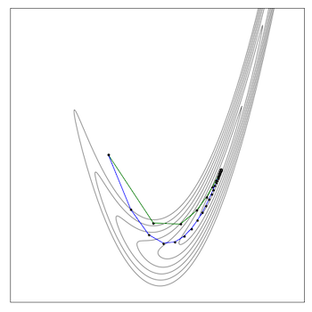
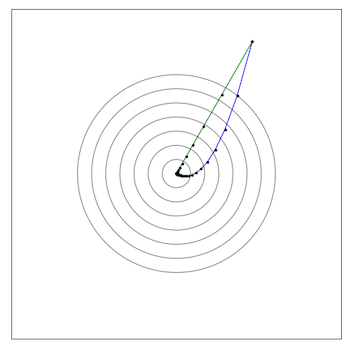
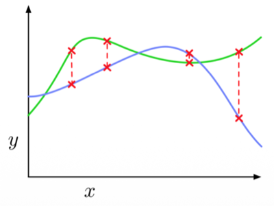
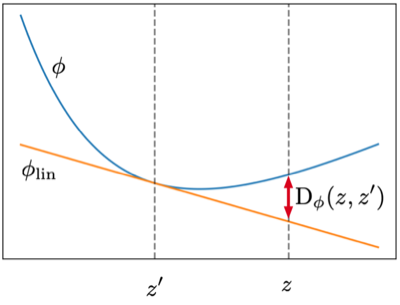
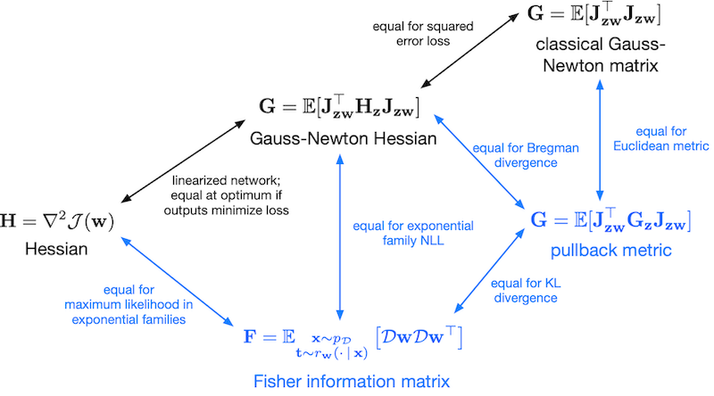
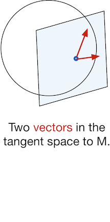
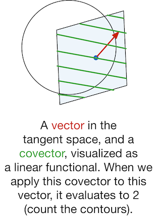
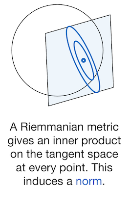
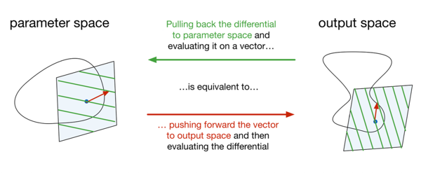
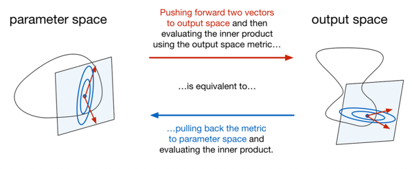

# 3. Metrics

신경망에서 proximal operator 및 natural gradient를 적용해 볼 것이다. 이를 위해선 output space에서 metric을 정의한 뒤, 신경망의 weight space로 **pull back**해야 한다.

---

## 3.4 Function Space Distance

출력 공간 점만 입력으로 하는 $g$ 함수를, (파라미터를 출력으로 보내는) $f$ 함수를 활용한 합성을 통해 parameter space로 **Pullback**할 수 있다.

$$f^* g(\mathbf{x} _1, \ldots, \mathbf{x} _K) = g(f(\mathbf{x} _1), \ldots, f(\mathbf{x} _K))$$

그렇다면 (출력 공간의) 비유사도 함수 $\rho$ 를 pull back하면 어떨까?

$$f^*\rho(\mathbf{x}, \mathbf{x}') = \rho(f(\mathbf{x}), f(\mathbf{x}'))$$

- metric matrix

  - $\mathbf{z} = \mathbf{z} _0$ (최솟점)에서는 $\partial\rho/\partial z_a = 0$

  - $\mathbf{J} _{\mathbf{z}\mathbf{x}} = \partial f / \partial \mathbf{x}$

```math
\begin{align*}
\mathbf{G} _{\mathbf{x}} 
&= \nabla^2_{\mathbf{x}} f^*\rho(\mathbf{x}, \mathbf{x} _0)\big|_{\mathbf{x} = \mathbf{x} _0} \\
&= \mathbf{J} _{\mathbf{z}\mathbf{x}}^\top \Big[\nabla^2_{\mathbf{z}} \rho(\mathbf{z}, \mathbf{z} _0)\big|_{\mathbf{z} = \mathbf{z} _0}\Big] \mathbf{J} _{\mathbf{z}\mathbf{x}} + \underbrace{\sum_a \frac{\partial \rho}{\partial z_a} \nabla^2_{\mathbf{x}} [f(\mathbf{x})]_a}_{=\,0} \\
&= \mathbf{J} _{\mathbf{z}\mathbf{x}}^\top \mathbf{G} _{\mathbf{z}} \mathbf{J} _{\mathbf{z}\mathbf{x}}
\end{align*}
```

> **Note**: 일차 미분이 $\frac{d}{dx}\, \rho(f(x)) = \rho'(f(x)) \cdot f'(x)$ 이며, 이차 미분 시 $f'$ 가 두 번 곱해진다.

분해 형태가 GN Hessian(Lecture 2)과 똑같지만, 결정적 차이가 존재한다. 바로 <U>오른쪽 항이 **정확히** 0이다</U>. 다시 말해 GN Hessian은 오른쪽 항을 drop하는 근사였지만, pullback metric은 근사가 아니라 등식이다.

---

### 3.4.1 Example: Rosenbrock Function

비유사도 함수를 (제곱) 유클리드 거리 $\rho_{\mathrm{euc}}(\mathbf{z}, \mathbf{z}') = \frac{1}{2}\|\mathbf{z} - \mathbf{z}'\|^2$ 로 둔 Rosenbrock 예제에서, pull back을 적용해 보자.

$$f^*\rho_{\mathrm{euc}}(\mathbf{x}, \mathbf{x}') = \frac{1}{2}\|f(\mathbf{x}) - f(\mathbf{x}')\|^2$$

유클리드 거리이므로 $\mathbf{G} _{\mathbf{z}} = \mathbf{I}$ 이며, 따라서 $\mathbf{G} _{\mathbf{x}} = \mathbf{J} _{\mathbf{z}\mathbf{x}}^\top \mathbf{J} _{\mathbf{z}\mathbf{x}}$ 이다. 업데이트 궤적을 보면 <U>출력 공간에서 원형 그릇을 곧장 내려가게 된다.</U>

- (param) 골짜기를 따라 내려간다.

- (output) 원형 그릇의 중심을 향해 거의 직선으로 이동한다.

| parameter space | output space |
|:---:|:---:|
|  |  |

> 역함수 없이 3.1절의 '반칙'을 재현한 셈이다.

---

### 3.4.2 Generalization to Neural Networks

신경망 $f(\mathbf{w}, \mathbf{x})$ 에서는 가중치를 정해도 출력이 입력에 따라 달라진다. 즉 가중치 하나가 정하는 것은 출력 점 하나가 아니라 입력 $\rightarrow$ 출력 대응(함수) 전체다. 따라서, $\mathbf{w}$ 가 $\mathbf{w}'$ 와 얼마나 다른가는, <U>두 함수를 비교하는 문제</U>로 바라보아야 한다.

- 즉, 어떤 입력 $\mathbf{x}$ 에서의 출력 비교 $\rho(f(\mathbf{w}, \mathbf{x}), f(\mathbf{w}', \mathbf{x}))$ 의 **기댓값**으로 거리를 정의한다.

$$\rho_{\mathrm{pull}}(\mathbf{w}, \mathbf{w}') = \mathbb{E}_{\mathbf{x}}\big[\rho(f(\mathbf{w}, \mathbf{x}), f(\mathbf{w}', \mathbf{x}))\big] $$

샘플이 유한한 경우는 다음과 같이 식을 작성한다.

$$\rho_{\mathrm{pull}}(\mathbf{w}, \mathbf{w}') = \frac{1}{N} \sum_{i=1}^{N} \rho\big(f(\mathbf{w}, \mathbf{x} ^{(i)}),\ f(\mathbf{w}', \mathbf{x} ^{(i)})\big)$$

다음은 두 가중치 $\mathbf{w}$ 와 $\mathbf{w}'$ 가 정하는 함수에서, 유한한 샘플링 $\mathbf{x} ^{(i)}$ 에서 거리를 측정한 그림이다.



- metric matrix (신경망은 기댓값 형태로 산출)

$$\begin{align*}
\mathbf{G} _{\mathbf{w}} 
&= \nabla^2_{\mathbf{w}} \rho_{\mathrm{pull}}(\mathbf{w}, \mathbf{w}')\big|_{\mathbf{w} = \mathbf{w}'} \\
&= \mathbb{E}_{\mathbf{x}}\big[\nabla^2_{\mathbf{w}} \rho(f(\mathbf{w}, \mathbf{x}), f(\mathbf{w}', \mathbf{x}))\big] \\
&= \mathbb{E}_{\mathbf{x}}\big[\mathbf{J} _{\mathbf{z}\mathbf{w}}^\top \mathbf{G} _{\mathbf{z}} \mathbf{J} _{\mathbf{z}\mathbf{w}}\big]
\end{align*}$$

> 이후부터는 **pullback metric**이라고 지칭할 것이다. (정식 명칭은 아니다.)

---

## 3.5 Connection to Gauss-Newton Hessian

Pullback metric의 분해식이 Gauss-Newton Hessian과 같은 형태인 건 우연이 아니다.

| 행렬 | 정의 | 가운데 행렬 |
|:---|:---|:---|
| Gauss-Newton Hessian | $\mathbf{G} = \mathbb{E}_{\mathbf{x}}[\mathbf{J} _{\mathbf{z}\mathbf{w}}^\top \mathbf{H} _{\mathbf{z}} \mathbf{J} _{\mathbf{z}\mathbf{w}}]$ | 출력 손실의 Hessian $\mathbf{H} _{\mathbf{z}}$ |
| Pullback metric | $\mathbf{G} = \mathbb{E}_{\mathbf{x}}[\mathbf{J} _{\mathbf{z}\mathbf{w}}^\top \mathbf{G} _{\mathbf{z}} \mathbf{J} _{\mathbf{z}\mathbf{w}}]$ | 출력 공간 metric $\mathbf{G} _{\mathbf{z}}$ |

즉, $\mathbf{G} _{\mathbf{z}} = \mathbf{H} _{\mathbf{z}}$ 이면 동일하다. 예를 들어 '제곱 오차 손실 + 유클리드 거리'는 $\mathbf{H} _{\mathbf{z}} = \mathbf{G} _{\mathbf{z}} = \mathbf{I}$ 이므로, 둘 다 고전적인 **Gauss-Newton matrix** $\mathbb{E}[\mathbf{J} _{\mathbf{z}\mathbf{w}}^\top \mathbf{J} _{\mathbf{z}\mathbf{w}}]$ 로 동일하다.

---

### 3.5.1 Bregman Divergence

Bregman divergence는 $\mathbf{G} _{\mathbf{z}} = \mathbf{H} _{\mathbf{z}}$ (pullback metric = GN Hessian) 조건을 만족하는 비유사도를, 임의의 볼록 손실에서 획득할 수 있는 방법이다.

- $\phi$ : (출력 $\mathbf{z}$ 를 입력으로 하는) strictly convex function

$$D_\phi(\mathbf{z}, \mathbf{z}') = \phi(\mathbf{z}) - \phi(\mathbf{z}') - \nabla\phi(\mathbf{z}')^\top(\mathbf{z} - \mathbf{z}')$$



> $\phi$ 가 볼록이므로 항상 $\ge 0$ 이며, 거리가 벌어지는 속도는 $\phi$ 의 곡률이 결정한다.

- $D_\phi$ 의 Hessian: $\phi$ 자신의 Hessian만 남는다. (이차 미분에서 상수항 및 일차항 소거)

$$\begin{align*}
\nabla^2_{\mathbf{z}} D_\phi(\mathbf{z}, \mathbf{z}')\big|_{\mathbf{z}=\mathbf{z}'} 
&= \nabla^2_{\mathbf{z}} \Big[\phi(\mathbf{z}) - \phi(\mathbf{z}') - \nabla\phi(\mathbf{z}')^\top(\mathbf{z} - \mathbf{z}')\Big] \Big|_{\mathbf{z} = \mathbf{z}'} \\
&= \nabla^2_{\mathbf{z}} \Big[\phi(\mathbf{z}) \Big] \Big|_{\mathbf{z} = \mathbf{z}'} \\
&= \nabla^2 \phi(\mathbf{z}')
\end{align*}$$

따라서 손실 $\mathcal{L}$ 이 볼록이면 $\phi = \mathcal{L}$ 로 골라 $D_{\mathcal{L}}$ 을 비유사도로 쓰면 된다. 그러면 자동으로 $\mathbf{G} _{\mathbf{z}} = \nabla^2 \mathcal{L} = \mathbf{H} _{\mathbf{z}}$ 가 되어, pullback metric = GN Hessian이 성립한다.

- (squared) 유클리드 거리

$$ \phi(\mathbf{z}) = \frac{1}{2}\|\mathbf{z}\|^2 \quad\Longrightarrow\quad D_\phi(\mathbf{z}, \mathbf{z}') = \frac{1}{2} \|\mathbf{z} - \mathbf{z}'\|^2 $$

- KL divergence

$$\phi(\mathbf{z}) = \log Z(\mathbf{z}) \quad\Longrightarrow\quad D_\phi(\mathbf{z}, \mathbf{z}') = D_{\mathrm{KL}}\big(p_{\mathbf{z}'} \,\|\, p_{\mathbf{z}}\big)$$

> **Note**: $Z$ 의 유래
>
> - 각 클래스 점수 $e^{z_k}$ 를 매기고, 분모는 이를 모두 더한 값(partition function) $Z$ 로 나누면 확률이 된다.
>
>   - 각 클래스에 대한 확률 분포 $p(\mathbf{t} \mid \mathbf{z})$ , 여기서 $t$ 는 target 후보.
>
> $$p(t = k \mid \mathbf{z}) = \frac{e^{z_k}}{\sum_j e^{z_j}}$$
>
> - log partition function( $\log Z(\mathbf{z}) = \log \sum_j e^{z_j}$ ): $\mathbf{z}$ 를 입력으로 숫자 하나를 반환하는 볼록 함수이다.

---

## 3.6 Fisher Information Matrix for Neural Networks

> [Limitations of the Empirical Fisher Approximation 논문(2019)](https://arxiv.org/abs/1905.12558)

이번에는 KL divergence를 비유사도 $\rho$ 로 삼고( $\mathbf{G} _{\mathbf{z}} = \mathbf{F} _{\mathbf{z}}$ , 3.3절 참조 ), pullback metric을 구해 보자.

$$\mathbb{E}_{\mathbf{x}}[\mathbf{J} _{\mathbf{z}\mathbf{w}}^\top \mathbf{F} _{\mathbf{z}} \mathbf{J} _{\mathbf{z}\mathbf{w}}]$$

score 벡터 $\mathcal{D}\mathbf{z} = \nabla_{\mathbf{z}} \log p(\mathbf{t} \mid \mathbf{z})$ 는, 로짓 $\mathbf{z}$ 가 변할 때 target의 로그 확률 변화를 나타낸다. (그리고 로짓 $\mathbf{z}$ 는 가중치 $\mathbf{w}$ 와 입력 $\mathbf{x}$ 에 의해 결정된다.)

> $\mathcal{D}\mathbf{z}$ : 3.5.1절 Bregman에서의 $D$ 와 다른 의미의 기호이므로 착오 주의

- 수식을 정리한다.( $\mathcal{D}\mathbf{w} = \mathbf{J} _{\mathbf{z}\mathbf{w}}^\top \mathcal{D}\mathbf{z}$ 로 치환 )

$$\begin{align*}
\mathbf{F} _{\mathbf{w}} &= \mathbb{E}_{\mathbf{x} \sim p_{\mathrm{data}}}\big[\mathbf{J} _{\mathbf{z}\mathbf{w}}^\top \mathbf{F} _{\mathbf{z}} \mathbf{J} _{\mathbf{z}\mathbf{w}}\big] \\
&= \mathbb{E}_{\mathbf{x} \sim p_{\mathrm{data}}}\Big[\mathbf{J} _{\mathbf{z}\mathbf{w}}^\top\, \mathbb{E}_{\mathbf{t} \sim r(\cdot \mid \mathbf{x})}\big[\mathcal{D}\mathbf{z}\, \mathcal{D}\mathbf{z} ^\top\big]\, \mathbf{J} _{\mathbf{z}\mathbf{w}}\Big] \\
&= \mathbb{E}_{\substack{\mathbf{x} \sim p_{\mathrm{data}} \\ \mathbf{t} \sim r(\cdot \mid \mathbf{x})}}\big[\mathbf{J} _{\mathbf{z}\mathbf{w}}^\top \mathcal{D}\mathbf{z}\, \mathcal{D}\mathbf{z} ^\top \mathbf{J} _{\mathbf{z}\mathbf{w}} \big] \\
&= \mathbb{E}_{\substack{\mathbf{x} \sim p_{\mathrm{data}} \\ \mathbf{t} \sim r(\cdot \mid \mathbf{x})}}\big[\mathcal{D}\mathbf{w}\, \mathcal{D}\mathbf{w} ^\top\big]
\end{align*}$$

마지막 수식은 chain rule( $\log p$ 를 가중치로 미분한 gradient는, 출력으로 미분한 gradient에 $\mathbf{J} ^\top$ 을 곱한 것 )로 얻는다. 즉, backprop 한 번(VJP)+outer product로 샘플 하나를 얻는다. (샘플을 여러 개를 얻어 기댓값을 추정해야 한다.)

> $\mathbf{x} \sim p_{\mathrm{data}},\ \mathbf{t} \sim r(\cdot \mid \mathbf{x})$ : 데이터에서 입력 $\mathbf{x}$ 를 샘플링하고, 그 입력에서의 모델 예측 분포에서 타깃 $\mathbf{t}$ 를 샘플링한다.

모델의 예측 분포에서 샘플링한 타깃 $t$ 은 데이터셋의 정답(입력-정답 쌍)이 아니라는 점에 주목해야 한다. (<U>실제 정답과 무관하며 가중치 업데이트 목적으로는 활용되지 않는다</U>)

>**Note**: backprop의 목적은 통계 $\mathbb{E}[\mathcal{D}\mathbf{w}\, \mathcal{D}\mathbf{w} ^\top] = \mathbf{F} _{\mathbf{w}}$ 를 얻는 것이다.
>
> 그러므로 정답과 무관하게, '가중치가 흔들리면 모델의 예측 분포가 (방향별로) 얼마나 민감하게 변하나'를 알 수 있다.

> **Note**: Empirical Fisher(Lecture 5)와 혼동 주의
>
> true Fisher와 달리, **empirical Fisher**는 정답을 보고 샘플별 오차를 반영한다. 
>
> - 모델이 데이터를 잘 맞추는(동시에 과적합이 아닌) 학습 후반에는 $\mathbf{F}_{\mathrm{emp}} \approx \mathbf{F}$ 이 성립한다. (<U>추가 샘플링 비용 불필요</U>)
>
> - 단, 데이터를 거의 정확하게 맞출 정도로 오차가 줄면, $\mathbf{F} _{\mathrm{emp}} \to 0$ 이 되면서, 곡률을 0으로 잘못 판단할 수 있다. 
>
> $$\mathbf{F} _{\mathrm{emp}} = \mathbb{E}_{(\mathbf{x}, \mathbf{t}) \sim p_{\mathrm{data}}}\big[\mathcal{D}\mathbf{w}\, \mathcal{D}\mathbf{w} ^\top\big]$$
>
> | | True Fisher $\mathbf{F}$ | Empirical Fisher $\mathbf{F} _{\mathrm{emp}}$ |
> |:---|:---|:---|
> | 타깃의 출처 | **모델의 예측 분포**에서 샘플링 | **학습 데이터의 실제 타깃**(정답) |
> | Hessian과의 관계 | GN Hessian과 연관 (KL의 Bregman 구조) | (주의) Hessian의 근사로 <U>해석할 수 없음</U> |

---

### 3.6.1 Relationship to Other Metrics

Fisher metric은 편리하지만, 신경망을 최적화할 때 Fisher가 유일한 정답인 것은 아니다. 대부분의 알고리즘에서 여러 다른 출력 공간 metric을 사용해도 된다.

- 화살표: 두 행렬이 일치하기 위한 조건

- 검정은 곡률(Hessian), 파랑은 metric 계열



| Matrix 1 | Matrix 2 | Condition |
|:---|:---|:---|
| Hessian $\mathbf{H}$ | GN Hessian $\mathbf{G}$ | 선형화한 네트워크이거나, 출력이 손실을 최소화하는 지점(최적점)이면 등호 (Lecture 2) |
| GN Hessian $\mathbf{G}$ | Pullback metric $\mathbf{G}$ | $\rho$ 가 볼록 손실의 Bregman divergence일 때 (3.5절) |
| GN Hessian $\mathbf{G}$ | Fisher $\mathbf{F}$ | $\mathcal{L}(\mathbf{z}) = \log Z(\mathbf{z}) - \mathbf{z} ^\top T(\mathbf{t})$ 형태일 때<br>(e.g., softmax + cross-entropy) (3.5절) |
| Pullback metric $\mathbf{G}$ | Fisher $\mathbf{F}$ | $\rho$ 가 KL divergence일 때 (3.3, 3.6절) |
| GN/pullback | 고전적 GN matrix $\mathbb{E}[\mathbf{J} ^\top \mathbf{J}]$ | 제곱 오차 손실 / 유클리드 출력 metric일 때 (3.5절) |

> 세 번째 설명의 기호: softmax의 경우, $T$ 는 one-hot, $Z = \sum_j e^{z_j}$ 

---

## 3.7 Invariance and Differential Geometry

경사 하강법에서 지금까지 살펴본 metric이 필요한 이유는, 최적화에서 일종의 **차원 오류**(type error)를 저지르기 때문이다. 다음 선형 회귀 예제에서, 단위(차원)을 함께 살펴보자.

```math
\overbrace{y}^{\text{output: \$}} = \underbrace{w_1}_{\text{\$/min}} \overbrace{x_1}^{\text{input: min}} + \underbrace{w_2}_{\text{\$/ft}} \overbrace{x_2}^{\text{input: ft}} + \underbrace{b}_{\text{\$}}
```

- 경사 하강법

```math
w_1 \leftarrow \overbrace{w_1}^{\text{\$/min}} - \underbrace{\alpha}_{\$^2/\mathrm{min}^2}\, \overbrace{\frac{\mathrm{d}h}{\mathrm{d}w_1}}^{\text{min/\$}}, \qquad w_2 \leftarrow \overbrace{w_2}^{\text{\$/ft}} - \underbrace{\alpha}_{\$^2/\mathrm{ft}^2}\, \overbrace{\frac{\mathrm{d}h}{\mathrm{d}w_2}}^{\text{ft/\$}}
```

주목할 부분은 두 가지다.

**(1)** <U>학습률은 하나인데, 좌표마다 다른 단위를 요구</U>한다.

**(2)** 결국 <U>파라미터 단위와, 실제 업데이트 단위가 일치하지 않는다</U>.

- $w_1$ : 업데이트는 원래 이동량 $\Delta w_1$ 의 단위인 \$/min으로 이루어져야 한다. 

- $\partial \mathcal{J} / \partial w_1$ : 그러나 미분은 '비용의 변화를 $w_1$ 변화로 나눈 것'이므로, <U>단위가 min/\$이며 불일치</U>한다.

> **Note**: 이 때문에 경사 하강법은, 입력의 아핀 변환에 불변이 아니다. 
>
> - $x_1$ 의 단위를 분에서 초로 바꾸면( $\bar w_1 = w_1/60$ ), 미분은 60배 커진다. 
>
> - 즉, 경사 하강 스텝이 원래 좌표계로 환산했을 때보다 **3600배** 커진다.

차원 오류를 해결하려면, $w_2$ 기준으로는 업데이트에 $`\$^2/\mathrm{ft} ^2`$ 를 곱해주는 변환이 필요하다. (이것이 pullback metric의 역변환 $\mathbf{G}^{-1}$ 행렬에서, 대각 성분이 하는 역할이다.)

---

### 3.7.1 Vector, Covector, Riemannian Metric

차원 오류를 바로잡으려면, 각 객체(이동량, 미분, metric 등)가 다른 공간(parameter, output space)에 어떻게 옮겨지는지 알아야 한다.

- **Can be pushed forward**

  - points

  - **tangent vectors**(접벡터): 어느 점에서, 어느 방향으로, 어느 속도로 움직이는 중인가

  - 확률 분포

- **Can be pulled back**

  - functions

  - **covectors**(dual vectors): 벡터를 입력으로, 스칼라를 출력하는 선형 함수 (e.g., 미분은 방향 $\Delta\mathbf{w}$ 를 입력으로, 비용의 1차 변화량 $\nabla\mathcal{J}^\top\Delta\mathbf{w}$ 을 출력) 

  - **Riemannian metrics**: 두 벡터를 입력으로, 내적(스칼라)을 출력하는 함수 (c.f., 내적이 있으면 길이와 각도가 정의된다.)

> **Note**: 후술에서 언급(3.7절 이후)하는 벡터는 모두 tangent vector를 의미한다.

| Vectors<br>(빨간 화살표)| Covectors<br>(초록 등고선 다발) | Riemannian Metric<br>(파랑 타원=길이가 동일한 벡터의 등고선) |
| :---: | :---: | :---: |
|  |  |  |

> **Note**: 기하학적 직관
>
> - covector: vector와 곱했을 때 '가로지르는 등고선 수'(스칼라)를 반환한다. (비용이 얼마나 변하는가)
>
> - metric $\mathbf{G}$ 는 현재 위치 $\mathbf{w}$ 마다 달라진다. 그러므로 Riemannian metric은 각 점 $\mathbf{w}$ 의 접공간에서의 내적으로 정의한다.

---

### 3.7.2 Examples

실제로 pull back과 push forward가 가능한지(어느 공간에서 계산해도 값이 보존되는지) 살펴보자.

**(1)** covector $\omega$ 로 '현재 위치에서 $\mathbf{v}$ 만큼 움직이면, 비용이 얼마나 변하는가' 측정

| 파라미터 공간에서 읽기 | 출력 공간에서 읽기 |
| --- | --- |
| (1) covector의 backprop $\mathbf{J} ^\top\omega$ 을 획득한다. (**pulling back**)<br>(2) 파라미터 공간에서, 비용이 얼마나 변하는가를 읽는다: $(\mathbf{J} ^\top\omega) ^\top\mathbf{v}$  | (1) 파라미터를 $\mathbf{v}$ 만큼 움직이면 출력이 $\mathbf{J}\mathbf{v}$ 만큼 움직인다. (**pushing forward**)<br>(2) 출력 공간에서, 비용이 얼마나 변하는가를 읽는다: $\omega ^\top(\mathbf{J}\mathbf{v})$  |



$(\mathbf{J} ^\top\omega)^\top\mathbf{v} = \omega^\top\mathbf{J}\mathbf{v}$
로, 두 값이 같다.

> **Note**: 경사 하강법의 차원 오류는, covector의 계수를 $\mathbf{v}$ 자리에 삽입하면서 발생한다.

**(2)** metric $\mathbf{G} _{\mathbf{z}}$ 으로 두 벡터 $\mathbf{v}, \mathbf{v}'$ 의 내적 계산

| 파라미터 공간에서 읽기 | 출력 공간에서 읽기 |
| --- | --- |
| (1) metric을 $\mathbf{J} ^\top \mathbf{G} _{\mathbf{z}} \mathbf{J}$ 으로 파라미터 공간에 가져온다.<br>(2) 내적한다: $\mathbf{v} ^\top(\mathbf{J} ^\top \mathbf{G} _{\mathbf{z}} \mathbf{J})\mathbf{v}'$ | (1) 두 벡터를 출력 공간으로 보낸다.<br>(2) 출력 공간의 metric으로 내적한다: $(\mathbf{J}\mathbf{v})^\top \mathbf{G} _{\mathbf{z}} (\mathbf{J}\mathbf{v}')$ |



앞서 (3.4절에서) 살펴본 $\mathbf{J} ^\top \mathbf{G} _{\mathbf{z}} \mathbf{J}$ 항이 보이며, 이것이 바로 pullback metric의 정체다.

---

### 3.7.3 Summary

경사 하강법은 vector를 대입해야 할 자리에, covector의 계수 $\nabla\mathcal{J}$ 를 대입한다.

(1) covector의 계수에서 각 성분의 단위가 다르기 때문에, 비교를 위한 metric이 필요하다.

(2) metric과의 내적이 $\nabla\mathcal{J}$ 가 되는 대리 벡터 $\mathbf{u}$ 를 구하면, 차원 오류를 해결할 수 있다.

$$\mathbf{G} _{\mathbf{w}} \mathbf{u} = \nabla\mathcal{J}$$

- $\mathbf{G} _{\mathbf{w}}$ 가 positive definite이므로 역이 항상 존재하며, 유일 해가 보장된다.

$$\mathbf{u} = \mathbf{G} _{\mathbf{w}}^{-1} \nabla\mathcal{J}$$

이러한 대리 벡터로의 변환을 **musical isomorphism**이라 부르며, 비용의 미분(covector)에 대한 변환 버전을 **natural gradient**라 부른다.

$$\tilde{\nabla} \mathcal{J}(\mathbf{w}) = \mathbf{G} _{\mathbf{w}}^{-1} \nabla \mathcal{J}(\mathbf{w})$$

> **Note**: natural의 의미
>
> $\mathbf{G} _{\mathbf{w}}$ 를 좌표와 무관하게 정의하면(출력 공간에서 pull back한 metric, Fisher), 업데이트도 좌표 선택에 불변(**invariance**)이다.

---